# Quete Agentique — Carnet de progression (XP - Niveaux - Badges)

> **Couche de gamification du domaine `agentic-ai`.** Un seul fichier, 100% markdown
> (la carte de quete est un diagramme Mermaid rendu nativement par GitHub — aucun
> binaire). Objectif : rendre la progression **visible et recompensee**, sans trahir
> la rigueur evidence-based du repo. Chaque mecanique est branchee sur un principe
> d'apprentissage prouve (voir [Regles du jeu](#regles-du-jeu) — la science derriere
> les points).

**Comment jouer** : tu coches au fur et a mesure, tu additionnes tes XP, tu montes
de niveau, tu debloques des badges. Tu peux cocher directement (fork du repo) ou
copier ce fichier dans `03-exercises/workspace/` (gitignore) si tu ne veux pas
versionner ta progression.

`☐` = a faire · `☑` = fait. Remplace le glyphe quand tu valides une case.

---

## Bareme XP

| Action | XP | Principe vise |
|---|---|---|
| 📖 Lire un module de theorie **+ s'auto-tester sur ses flash-cards** | 10 | Active recall |
| 💻 Lancer le code `02-code/NN-*.py` et comprendre la sortie | 10 | Concret-d'abord |
| 🟢 Exercices **easy** d'un module | 10 | Pratique deliberee |
| 🟡 Exercices **medium** d'un module | 15 | Surcharge progressive |
| 🔴 Exercices **hard** (mini-projet) d'un module | 25 | Surcharge progressive |
| 🥇 **Capstone** livre (J14 / J28) ou projet guide `05-projets-guides/` | +bonus | Capstone portfolio |
| 🔥 **Bonus streak / interleaving / recall** | variable | Repetition espacee |

> Module standard entierement valide = **70 XP** (10+10+10+15+25). Les 28 modules
> valent donc ~1960 XP de socle ; capstones, projets guides et bonus completent
> la barre jusqu'a la maitrise (~2400 XP).

---

## Niveaux

Ta jauge XP te place sur l'arc du curriculum (du premier agent ReAct a l'architecte) :

| Palier | Rang | XP requis |
|---|---|---|
| 1 | 🥚 **Apprenti ReAct** | 0 |
| 2 | 🔨 **Forgeron d'Outils** (Tool-Smith) | 250 |
| 3 | 🧠 **Gardien de la Memoire** | 550 |
| 4 | 🕸️ **Chef d'Orchestre Multi-Agent** | 950 |
| 5 | 🚀 **Ingenieur de Production** | 1400 |
| 6 | 🔭 **Pionnier Frontier** | 1900 |
| 7 | 🏛️ **Architecte Agentique** | 2300 |

**Mon total actuel : `____ XP` → Rang : `__________`**

---

## Carte de quete (skill-tree)

```mermaid
flowchart LR
  subgraph S1["Semaine 1 - Fondations"]
    direction LR
    J1[J1 Anatomie] --> J2[J2 Tool Use] --> J3[J3 Memory] --> J4[J4 Planning] --> J5[J5 LangGraph] --> J6[J6 LangGraph+] --> J7[J7 Build agent]
  end
  subgraph S2["Semaine 2 - Multi-agent & Prod"]
    direction LR
    J8[J8 RAG] --> J9[J9 Multi-agent] --> J10[J10 MCP] --> J11[J11 Eval] --> J12[J12 Prod] --> J13[J13 Securite] --> J14[J14 CAPSTONE]
  end
  subgraph S3["Semaine 3 - Frontier"]
    direction LR
    J15[J15 Context eng] --> J16[J16 Memoire LH] --> J17[J17 Verifiers] --> J18[J18 Orchestration] --> J19[J19 Protocoles] --> J20[J20 Durable] --> J21[J21 Coding agents]
  end
  subgraph S4["Semaine 4 - Echelle & Capstone+"]
    direction LR
    J22[J22 Computer use] --> J23[J23 Sandboxing] --> J24[J24 Inference] --> J25[J25 Serving] --> J26[J26 Benchmarking] --> J27[J27 Archi+] --> J28[J28 CAPSTONE+]
  end
  J7 --> J8
  J14 --> J15
  J21 --> J22
```

---

## Tableau de bord — 28 modules

Coche par pilier. `T` = theorie+flashcards · `C` = code · 🟢🟡🔴 = niveaux d'exos.

### Semaine 1 — Fondations Agent

| Jour | Module | T (10) | C (10) | 🟢 (10) | 🟡 (15) | 🔴 (25) | XP /70 |
|---|---|:--:|:--:|:--:|:--:|:--:|:--:|
| J1 | Anatomie d'un agent | ☐ | ☐ | ☐ | ☐ | ☐ | __ |
| J2 | Tool Use & Function Calling | ☐ | ☐ | ☐ | ☐ | ☐ | __ |
| J3 | Memory & State | ☐ | ☐ | ☐ | ☐ | ☐ | __ |
| J4 | Planning & Reasoning | ☐ | ☐ | ☐ | ☐ | ☐ | __ |
| J5 | LangGraph fondamentaux | ☐ | ☐ | ☐ | ☐ | ☐ | __ |
| J6 | LangGraph avance | ☐ | ☐ | ☐ | ☐ | ☐ | __ |
| J7 | Build : agent complet | ☐ | ☐ | ☐ | ☐ | ☐ | __ |

### Semaine 2 — Multi-Agent & Production

| Jour | Module | T (10) | C (10) | 🟢 (10) | 🟡 (15) | 🔴 (25) | XP /70 |
|---|---|:--:|:--:|:--:|:--:|:--:|:--:|
| J8 | RAG agentique | ☐ | ☐ | ☐ | ☐ | ☐ | __ |
| J9 | Multi-agent patterns | ☐ | ☐ | ☐ | ☐ | ☐ | __ |
| J10 | MCP | ☐ | ☐ | ☐ | ☐ | ☐ | __ |
| J11 | Evaluation & Testing | ☐ | ☐ | ☐ | ☐ | ☐ | __ |
| J12 | Production & Observabilite | ☐ | ☐ | ☐ | ☐ | ☐ | __ |
| J13 | Securite & Robustesse | ☐ | ☐ | ☐ | ☐ | ☐ | __ |
| J14 | **Capstone** (+30 bonus a la livraison) | ☐ | ☐ | ☐ | ☐ | ☐ | __ |

### Semaine 3 — Frontier patterns & orchestration

| Jour | Module | T (10) | C (10) | 🟢 (10) | 🟡 (15) | 🔴 (25) | XP /70 |
|---|---|:--:|:--:|:--:|:--:|:--:|:--:|
| J15 | Context engineering & compaction | ☐ | ☐ | ☐ | ☐ | ☐ | __ |
| J16 | Memoire long-horizon | ☐ | ☐ | ☐ | ☐ | ☐ | __ |
| J17 | Verifiers & self-improvement | ☐ | ☐ | ☐ | ☐ | ☐ | __ |
| J18 | Orchestration comparee & failure modes | ☐ | ☐ | ☐ | ☐ | ☐ | __ |
| J19 | Protocoles inter-agents | ☐ | ☐ | ☐ | ☐ | ☐ | __ |
| J20 | Durable & event-driven agents | ☐ | ☐ | ☐ | ☐ | ☐ | __ |
| J21 | Architecture des coding agents | ☐ | ☐ | ☐ | ☐ | ☐ | __ |

### Semaine 4 — Computer-use, echelle & capstone avance

| Jour | Module | T (10) | C (10) | 🟢 (10) | 🟡 (15) | 🔴 (25) | XP /70 |
|---|---|:--:|:--:|:--:|:--:|:--:|:--:|
| J22 | Computer use & GUI/browser agents | ☐ | ☐ | ☐ | ☐ | ☐ | __ |
| J23 | Sandboxing & execution sure | ☐ | ☐ | ☐ | ☐ | ☐ | __ |
| J24 | Inference engineering | ☐ | ☐ | ☐ | ☐ | ☐ | __ |
| J25 | Serving stateful & sessions a l'echelle | ☐ | ☐ | ☐ | ☐ | ☐ | __ |
| J26 | Benchmarking pratique | ☐ | ☐ | ☐ | ☐ | ☐ | __ |
| J27 | Capstone avance — architecture | ☐ | ☐ | ☐ | ☐ | ☐ | __ |
| J28 | **Capstone avance — build & eval** (+50 bonus) | ☐ | ☐ | ☐ | ☐ | ☐ | __ |

### Boss fights — projets guides (`05-projets-guides/`)

- [ ] 🥇 `01-agent-fleet-coordinator` — **+60 XP**
- [ ] 🥇 `02-supervisor-swarm-multi-tier` (projet phare) — **+60 XP**
- [ ] 🥇 `03-agent-eod-conversationnel` — **+60 XP**

---

## Badges (succes)

Debloque-les en validant la competence reelle, pas juste en cochant. Conditions
ancrees sur les [criteres de reussite](./README.md#criteres-de-reussite) du domaine.

- [ ] 🔁 **From-Scratch** — agent ReAct sans framework en < 100 lignes (J1 + J7)
- [ ] 🔨 **Tool Master** — J2 + exercice hard tool-use livre
- [ ] 🧠 **Memory Architect** — J3 + J16 (memoire long-horizon avec consolidation)
- [ ] 🕸️ **Swarm Whisperer** — J9 + projet guide `02-supervisor-swarm-multi-tier`
- [ ] 🔌 **MCP Plumber** — J10 : serveur MCP fonctionnel (resources + tools)
- [ ] 🔬 **Eval Engineer** — J11 + J26 : harness d'eval avec metrique pass^k + regression
- [ ] 🛡️ **Red-Teamer** — J13 (prompt injection) + J23 (choix de sandboxing motive)
- [ ] 💸 **Cost Hacker** — J24 : routing multi-modele + prompt caching, gain chiffre
- [ ] 🔭 **Frontier Architect** — semaines 3 et 4 completes (J15→J28)
- [ ] 🥇 **Capstone Shipper** — J14 **et** J28 livres et executables
- [ ] 🎴 **Recall 100** — 100 flash-cards auto-testees (toutes confondues)
- [ ] 🔥 **Streak-7** / 🔥🔥 **Streak-30** — 7 / 30 jours d'etude ou de revision d'affilee
- [ ] 🧩 **Interleaver** — une session melant >=3 modules differents

---

## Carnet de revision espacee (le 🔥 streak)

L'arme secrete : ne pas seulement avancer, mais **re-tester** les flash-cards des
modules passes a intervalles croissants (rythme SM-2 lite : J+1, J+3, J+7, J+16).
Cf. le domaine [`apprendre-a-apprendre`](../apprendre-a-apprendre/) (repetition
espacee, difficultes desirables). Chaque revision d'un module deja vu = **+5 XP**.

| Date | Modules revises | Auto-eval (facile/moyen/dur) | XP |
|---|---|---|:--:|
| | | | |
| | | | |
| | | | |

**Streak actuel : `__` jours · meilleur streak : `__` jours**

---

## Regles du jeu (la science derriere les points)

Cette couche n'est pas du vernis : chaque mecanique mappe un principe de la
[methodologie du repo](../../CLAUDE.md#learning-methodology-rules).

| Mecanique | Principe evidence-based | Pourquoi ca marche |
|---|---|---|
| XP pour l'auto-test des flash-cards (pas pour la lecture seule) | **Active recall** | Se tester ancre plus que relire ; la lecture passive ne donne d'XP qu'avec son quiz |
| Exos hard >> easy en XP | **Pratique deliberee** + surcharge progressive | On recompense l'effort a la limite de la zone de confort, pas la repetition du connu |
| Streak de revision espacee (+5 XP/revision) | **Repetition espacee** | Re-tester a intervalles croissants bat le bachotage pour la retention long-terme |
| Badge 🧩 Interleaver | **Interleaving** | Melanger les sujets ameliore le transfert vs blocs monolithiques |
| Paliers de niveau (gates XP) | **Surcharge progressive** | La difficulte monte par crans francs, jamais d'un coup |
| Capstones = gros bonus | **Capstone portfolio** | Le livrable montrable est l'objectif final de chaque domaine |

**Anti-triche (envers soi-meme)** : l'XP ne vaut que si la case correspond a une
competence reellement acquise. Un badge coche sans le livrable derriere ne trompe
que toi. Le vrai score, c'est ce que tu sais construire.

---

> 💡 **Reutilisable** : ce format (bareme + niveaux themes + skill-tree Mermaid +
> badges + carnet de revision) se transpose tel quel a n'importe quel domaine du
> repo — il suffit de re-habiller les rangs/badges sur le sujet et de remapper le
> tableau sur les modules. Candidat a une generalisation dans `shared/templates/`
> si l'idee plait.
