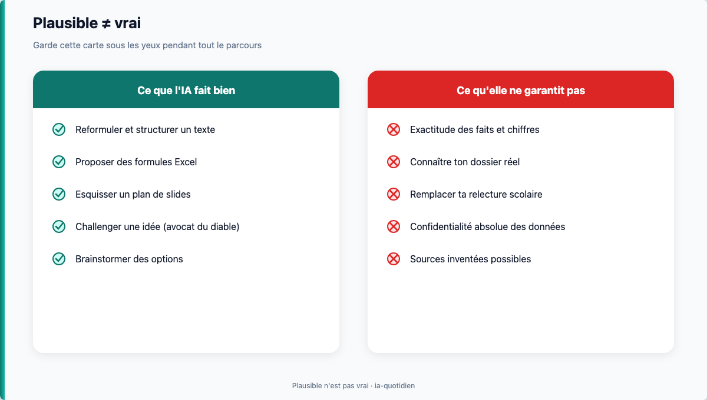

# Module 01 — IA : premiers pas

> **Temps estimé** : 45 min | **Prérequis** : aucun
>
> **Objectif** : Comprendre ce qu'est un outil comme ChatGPT en langage simple, ce qu'il fait vraiment, et arrêter de se sentir « en retard » parce que le hype va trop vite.

---



> **En une phrase :** regarde ce schéma avant de lire le reste.


> **Visuel** : garde cette carte sous les yeux pendant tout le parcours.


## Avant tout : 3 phrases de confiance

1. **ChatGPT propose du texte** à partir de ta demande.
2. **Il peut écrire quelque chose de faux** avec un ton sûr de lui.
3. **Ton réflexe :** demander → vérifier → décider.

> Le jargon (LLM, token, « perroquet stochastique ») est en bas de page dans *Pour aller plus loin*. Tu n'as pas besoin de le retenir pour réussir le jour 1.

## 1. Scène concrète : le lundi matin d'Alex

Alex ouvre ChatGPT. Elle tape : *« Écris-moi un budget pour mon association »*.

La réponse arrive en 10 secondes : catégories, pourcentages, ton confiant. Ça *a l'air* d'un document pro. Elle se dit : « Tout le monde sait déjà faire ça. Moi je débute. Je suis en retard. »

**Reprenons la scène au ralenti.**

1. Elle n'a pas fourni de vrais chiffres (bien).
2. L'outil a produit un *texte plausible* sur les budgets d'asso — pas le budget *de son* asso.
3. Rien n'a été vérifié. Rien n'a été personnalisé. Rien n'a été validé par elle.

> **À retenir :** L'IA ne « connaît » pas ta vie. Elle prédit la suite la plus probable d'un texte. La confiance dans le ton n'est pas une preuve.

---

## 2. C'est quoi, concrètement, ChatGPT ?

<details>
<summary>Pour aller plus loin (optionnel) — mots techniques</summary>


Un **LLM** (large language model) est un système entraîné à prédire le prochain *token* (morceau de mot) à partir d'énormes quantités de texte. Bender et al. (2021) parlent de **« stochastic parrots »** : des systèmes qui rassemblent des formes linguistiques sans compréhension stable du monde. [Stochastic Parrots, 2021]

Implications pratiques pour toi :

| Illusion courante | Réalité utile |
|-------------------|---------------|
| « Elle sait » | Elle *génère* du texte cohérent |
| « Si c'est détaillé, c'est vrai » | Le détail peut être inventé |
| « Tout le monde est expert » | La plupart des gens bricolent aussi |
| « Je dois tout suivre » | Tu as besoin de **3–5 usages** qui collent à ta vie |

Le *GPT-4 System Card* (OpenAI, 2023) documente explicitement les risques d'**hallucination** (invention confiante) et de mauvaise généralisation. [GPT-4 System Card, 2023]

> **À retenir :** Tu n'as pas à « suivre le flow » de toute l'IA. Tu as à maîtriser un **petit set d'usages** : réfléchir, écrire, Excel, PowerPoint.

---

</details>

## 3. Ce que l'IA fait bien / mal pour un profil non-tech

**Bien (avec toi aux commandes) :**

- reformuler, structurer, brainstormer ;
- proposer des formules Excel à partir d'une description ;
- esquisser un plan de slides ;
- jouer l'avocat du diable sur une idée.

**Mal (ou dangereux) :**

- inventer des chiffres, lois, citations ;
- « connaître » les règles internes de ton employeur / association ;
- remplacer ta relecture formation ;
- garantir la confidentialité de ce que tu colles dans le chat (règles du fournisseur + prudence).

---

## 4. Mini-carte du parcours (14 jours)

```
J1–J3 Bases & sécurité mentale
J4–J5 Réfléchir & écrire
J6–J9 Excel + projet trésorerie fictive
J10–J14 PowerPoint + capstone deck pitch
```

Outil principal : **ChatGPT**. Codex = bonus optionnel, hors chemin critique.

---

## 5. Exercice mental (2 min)

Complète sans l'IA :

1. Une chose que je veux que l'IA m'aide à faire d'ici 2 semaines : ________
2. Une chose que je refuse de coller dans un chat : ________
3. Mon critère de succès personnel (observable) : ________

---

## Spaced repetition

**Q1.** Un LLM « sait »-il des faits comme une base de données ?
**R1.** Non. Il prédit du texte plausible ; les faits doivent être vérifiés.

**Q2.** Pourquoi une réponse détaillée peut-elle être fausse ?
**R2.** Le modèle optimise la *vraisemblance*, pas la vérité factuelle (hallucination).

**Q3.** Cite un usage IA adapté à ce cours et un usage hors scope.
**R3.** In : plan de slides pitch. Out : entraîner un modèle / coder un agent.

**Q4.** Que signifie « stochastic parrot » en une phrase ?
**R4.** Un système qui recombine des formes de langage sans compréhension fiable du monde. [Stochastic Parrots, 2021]

**Q5.** Pourquoi « je suis en retard » est souvent un piège ?
**R5.** Le hype médiatise l'extrême ; la maîtrise utile = petits usages répétables.

<!-- NAV:START -->
---

← *(début du parcours)* · [Index des chapitres](../README.md#index-des-chapitres-cliquable) · [Mission easy](../03-exercises/01-easy/01-ia-sans-panique.md) · [Progression](../PROGRESS.md) · [Module 02 — Prompts qui marchent](./02-prompts-qui-marchent.md) →

<!-- NAV:END -->
