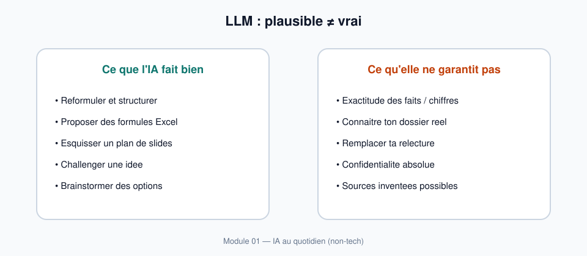

# Module 01 — IA sans panique

> **Temps estime** : 45 min | **Prerequis** : aucun
>
> **Objectif** : Comprendre ce qu'est un outil comme ChatGPT en langage simple, ce qu'il fait vraiment, et arreter de se sentir "en retard" parce que le hype va trop vite.

---



> **En une phrase :** regarde ce schema avant de lire le reste.


> **Visuel** : garde cette carte sous les yeux pendant tout le parcours.


## Avant tout : 3 phrases de confiance

1. **ChatGPT propose du texte** a partir de ta demande.
2. **Il peut ecrire quelque chose de faux** avec un ton sur de lui.
3. **Ton reflexe :** demander → verifier → decider.

> Le jargon (LLM, token, "perroquet stochastique") est en bas de page dans *Pour aller plus loin*. Tu n as pas besoin de le retenir pour reussir le jour 1.

## 1. Scene concrete : le lundi matin d'Alex

Alex ouvre ChatGPT. Elle tape : *« Ecris-moi un budget pour mon association »*.

La reponse arrive en 10 secondes : categories, pourcentages, ton confiant. Ca *a l'air* d'un document pro. Elle se dit : « Tout le monde sait deja faire ca. Moi je debute. Je suis en retard. »

**Reprenons la scene au ralenti.**

1. Elle n'a pas fourni de vrais chiffres (bien).
2. L'outil a produit un *texte plausible* sur les budgets d'asso — pas le budget *de son* asso.
3. Rien n'a ete verifie. Rien n'a ete personnalise. Rien n'a ete valide par elle.

> **A retenir :** L'IA ne "connait" pas ta vie. Elle predit la suite la plus probable d'un texte. La confiance dans le ton n'est pas une preuve.

---

## 2. C'est quoi, concretement, ChatGPT ?

<details>
<summary>Pour aller plus loin (optionnel) — mots techniques</summary>


Un **LLM** (large language model) est un systeme entraine a predire le prochain *token* (morceau de mot) a partir d'enormes quantites de texte. Bender et al. (2021) parlent de **« stochastic parrots »** : des systemes qui rassemblent des formes linguistiques sans comprehension stable du monde. [Stochastic Parrots, 2021]

Implications pratiques pour toi :

| Illusion courante | Realite utile |
|-------------------|---------------|
| « Elle sait » | Elle *genere* du texte coherent |
| « Si c'est detaille, c'est vrai » | Le detail peut etre invente |
| « Tout le monde est expert » | La plupart des gens bricolent aussi |
| « Je dois tout suivre » | Tu as besoin de **3–5 usages** qui collent a ta vie |

Le *GPT-4 System Card* (OpenAI, 2023) documente explicitement les risques d'**hallucination** (invention confiante) et de mauvaise generalisation. [GPT-4 System Card, 2023]

> **A retenir :** Tu n'as pas a "suivre le flow" de toute l'IA. Tu as a maitriser un **petit set d'usages** : reflechir, ecrire, Excel, PowerPoint.

---

</details>

## 3. Ce que l'IA fait bien / mal pour un profil non-tech

**Bien (avec toi aux commandes) :**

- reformuler, structurer, brainstormer ;
- proposer des formules Excel a partir d'une description ;
- esquisser un plan de slides ;
- jouer l'avocat du diable sur une idee.

**Mal (ou dangereux) :**

- inventer des chiffres, lois, citations ;
- "connaitre" les regles internes de ton employeur / association ;
- remplacer ta relecture formation ;
- garantir la confidentialite de ce que tu colles dans le chat (regles du fournisseur + prudence).

---

## 4. Mini-carte du parcours (14 jours)

```
J1–J3 Bases & securite mentale
J4–J5 Reflechir & ecrire
J6–J9 Excel + projet tresorerie fictive
J10–J14 PowerPoint + capstone deck pitch
```

Outil principal : **ChatGPT**. Codex = bonus optionnel, hors chemin critique.

---

## 5. Exercice mental (2 min)

Complete sans l'IA :

1. Une chose que je veux que l'IA m'aide a faire d'ici 2 semaines : ________
2. Une chose que je refuse de coller dans un chat : ________
3. Mon critere de succes personnel (observable) : ________

---

## Spaced repetition

**Q1.** Un LLM "sait"-il des faits comme une base de donnees ?
**R1.** Non. Il predit du texte plausible ; les faits doivent etre verifies.

**Q2.** Pourquoi une reponse detaillee peut-elle etre fausse ?
**R2.** Le modele optimise la *vraisemblance*, pas la verite factuelle (hallucination).

**Q3.** Cite un usage IA adapte a ce cours et un usage hors scope.
**R3.** In : plan de slides pitch. Out : entrainer un modele / coder un agent.

**Q4.** Que signifie "stochastic parrot" en une phrase ?
**R4.** Un systeme qui recombine des formes de langage sans comprehension fiable du monde. [Stochastic Parrots, 2021]

**Q5.** Pourquoi "je suis en retard" est souvent un piege ?
**R5.** Le hype mediatise l'extreme ; la maitrise utile = petits usages repetables.
