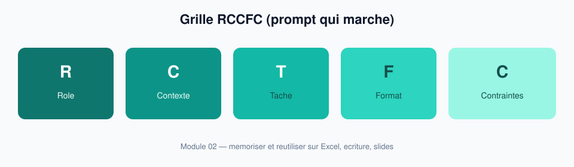
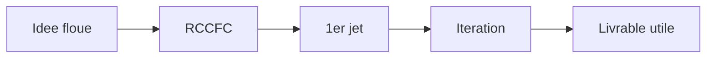

# Module 02 — Prompts qui marchent

> **Temps estime** : 45 min | **Prerequis** : Module 01
>
> **Objectif** : Remplacer les questions floues par une structure de prompt reutilisable (role, contexte, tache, format, contraintes).

---



> **En une phrase :** regarde ce schema avant de lire le reste.





## Version simple (a utiliser d abord)

Oublie les acronymes 2 minutes. Ecris seulement :

1. **Contexte** — mon tableau / mon sujet  
2. **Demande** — ce que je veux  
3. **Resultat attendu** — format (liste, formule, 5 puces…)

La grille **RCCFC** plus bas est la version complete (optionnelle le jour 1 des prompts).

## 1. Scene concrete : deux prompts, deux mondes

**Prompt A (flou) :**
> « Aide-moi pour mon PowerPoint. »

**Prompt B (structure) :**
> Tu es coach de presentation pour un formation en entrepreneuriat.
> Contexte : pitch de 7 minutes pour un projet de PME fictive de livraison locale en ville.
> Tache : propose une structure de 10 slides (titre + 1 phrase d'intention par slide).
> Format : liste numerotee.
> Contraintes : francais soutenu mais clair ; pas de jargon startup inutile ; aucune donnee inventee presentee comme reelle.

Le prompt B produit quelque chose d'*actionnable*. Le A produit du generique.

> **A retenir :** La qualite de sortie suit la qualite d'entree. Le modele n'est pas telepathe.

---

## 2. La grille RCCFC

Memorise :

| Lettre | Signifie | Exemple |
|--------|----------|---------|
| **R** | Role | "Tu es comptable pedagogue" |
| **C** | Contexte | "Je suis debutante, tableau mensuel" |
| **T** | Tache | "Propose 5 formules Excel..." |
| **F** | Format | "Tableau markdown" / "liste" / "JSON simple" |
| **C** | Contraintes | "Pas de VBA" ; "donnees fictives" ; "FR-CA" |

La doc officielle OpenAI sur le *prompt engineering* insiste sur des **instructions claires**, des **exemples**, et la precision du format de sortie. [OpenAI Prompting Guide]

---

## 3. Few-shot : montrer un exemple

Si tu veux un ton precis, donne **1 exemple** :

```
Exemple de bonne slide titre :
"Titre : Le probleme des 3 retards de paiement / Intention : faire sentir l'urgence en 10 secondes"

Maintenant, ecris les 9 autres selon le meme format.
```

---

## 4. Iteration (le vrai super-pouvoir)

Rarement le 1er jet est le bon. Enchaine :

1. "Raccourcis de 30 %."
2. "Supprime le jargon."
3. "Donne 2 alternatives plus concretes pour la slide 4."
4. "Qu'est-ce qui est faible dans cette structure ? Sois direct."

> **A retenir :** Un bon usage = conversation courte et dirigee, pas un monologue magique.

---

## 5. Trois prompts modeles a copier

### Reflexion carriere
```
Role : coach de carriere neutre.
Contexte : formation entrepreneuriat ; je explore un pivot.
Tache : pose-moi 8 questions (une par une) pour clarifier mes contraintes avant de proposer des pistes.
Contraintes : ne propose pas de plan avant la question 8 ; pas de cliches motivationnels.
```

### Excel
```
Role : formateur Excel pour non-developpeurs.
Contexte : colonnes Date | Libelle | Categorie | Montant | Type (entree/sortie).
Tache : donne les formules pour (1) total entrees (2) total sorties (3) solde.
Format : pour chaque formule : nom, formule FR-CA, explication en 1 phrase.
Contraintes : Excel Microsoft 365 ; pas de macros.
```

### Slides
```
Role : designer de presentation sobriete (Presentation Zen).
Tache : transforme ce plan en 10 titres de slides + 3 bullets max chacun.
Contraintes : une idee par slide ; pas de mur de texte.
```

---

## Spaced repetition

**Q1.** Que signifie RCCFC ?
**R1.** Role, Contexte, Tache, Format, Contraintes.

**Q2.** Pourquoi un prompt flou donne une reponse mediocre ?
**R2.** Le modele comble les trous par du generique "moyen".

**Q3.** Qu'est-ce qu'un few-shot ?
**R3.** Fournir 1+ exemples du format/ton attendu dans le prompt.

**Q4.** Quelle est la meilleure suite apres un 1er jet correct mais long ?
**R4.** Iterer : raccourcir, preciser, challenger — pas recommencer de zero.

**Q5.** Ou trouver des patterns officiels de prompting ?
**R5.** [OpenAI Prompting Guide]
