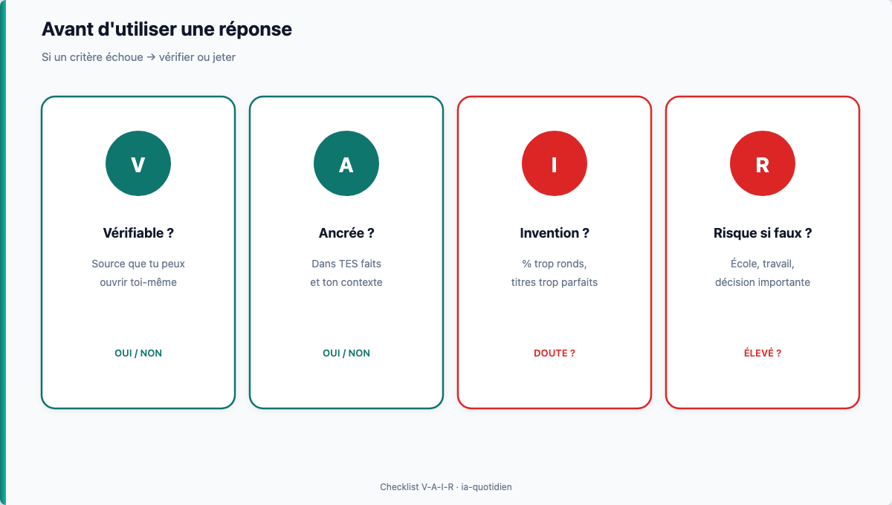
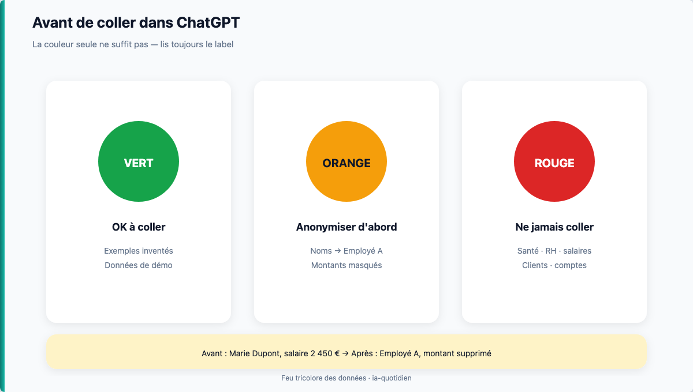

# Module 03 — Hallucinations & vérification

> **Temps estimé** : 45 min | **Prérequis** : Modules 01–02
>
> **Objectif** : Détecter les inventions plausibles, protéger les données sensibles, et appliquer une checklist avant usage scolaire ou pro.

---



> **En une phrase :** regarde ce schéma avant de lire le reste.


## 1. Scène concrète : la fausse statistique

Prompt : *« Donne-moi le taux moyen de défaillance des PME au Québec en 2024 avec source. »*

Réponse possible (exemple pédagogique) : un pourcentage précis + un « Rapport Statistique Canada 2024 » qui **n'existe pas sous cette forme**.

Le ton est confiant. Les chiffres sont ronds. **C'est exactement le danger.**

Le *GPT-4 System Card* reconnaît les hallucinations comme risque central. [GPT-4 System Card, 2023]

> **À retenir :** Traite toute stat, citation, loi ou « étude » comme **non prouvée** jusqu'à vérification externe.

---

## 2. Checklist V-A-I-R (simple, mémorable)

Avant d'utiliser une réponse pour l'école ou le travail :

| | Question | Si non → |
|--|----------|----------|
| **V** | **V**érifiable ? Y a-t-il une source que *je* peux ouvrir ? | Ne pas citer |
| **A** | **A**ncrée dans *mes* faits ? (mes chiffres, mon énoncé) | Ne pas coller tel quel |
| **I** | **I**nvention possible ? (date précise, % trop propre, auteur obscur) | Chercher confirmation |
| **R** | **R**isque si faux ? (note, client, légal) | Vérification obligatoire |

---




> **En une phrase :** si tu ne mettrais pas l'info sur un écran de bus, ne la mets pas dans le chat.

**Avant / après :** `Marie Dupont, salaire 2450` → `Employé A, montant supprimé`.

## 3. Données : ce qui ne se colle jamais

**Interdit dans le chat (cours + vraie vie) :**

- noms de clients, bénéficiaires, collègues ;
- salaires, numéros de compte, documents fiscaux réels ;
- données de santé, dossiers RH ;
- mots de passe, captures d'écran internes.

Préfère : **jeux de données fictifs** (comme le projet trésorerie J9).

Cadre utile : guides **CNIL** sur l'IA et principes de minimisation ; au Canada, principes de l'**OPC**. [CNIL IA] Le NIST AI RMF rappelle de penser *risque* même pour un usage « simple ». [NIST AI RMF]

> **À retenir :** Si tu n'afficherais pas cette info sur un écran de bus, ne la mets pas dans un LLM grand public.

---

## 4. Technique anti-hallucination dans le prompt

Ajoute systématiquement :

```
Si tu n'es pas sûr d'un fait, écris "INCERTAIN" et propose comment vérifier.
N'invente aucune source. Si tu cites, donne un type de source à chercher (ex. "site gouvernemental") sans inventer le titre exact.
Utilise uniquement les chiffres que je fournis : [coller chiffres fictifs].
```

---

## 5. Mini-protocole 60 secondes (entraînement)

1. Surligne dans la réponse tout chiffre, nom propre, citation, loi ou conseil.
2. Pour chaque élément que tu **conserves** :
   - retrouve une source que tu peux ouvrir ;
   - vérifie qu'elle soutient **exactement** la phrase ;
   - note son titre et son lien ;
   - retire l'élément si tu ne peux pas le confirmer.
3. **Pour cet exercice de 60 secondes** : vérifier **1 item critique** suffit.
4. **Pour un livrable scolaire ou professionnel** : vérifie **tous** les faits conservés.
5. Réécris la phrase finale **avec tes mots**.

> Un pourcentage « trop rond » ou un titre parfait peut **donner envie** de vérifier — ce n'est pas une preuve. Seule la source ouvrable tranche.

---

## Spaced repetition

**Q1.** Qu'est-ce qu'une hallucination LLM ?
**R1.** Une affirmation confiante fausse ou non fondée générée par le modèle.

**Q2.** Que faire d'une statistique sans source ouvrable ?
**R2.** Ne pas la citer ; chercher une source officielle ou l'ôter.

**Q3.** Donne 2 exemples de données à ne jamais coller.
**R3.** Identifiants clients / bénéficiaires ; salaires / documents fiscaux réels.

**Q4.** À quoi sert la contrainte « écris INCERTAIN » ?
**R4.** Forcer le modèle à signaler le doute au lieu d'inventer.

**Q5.** Cite un cadre institutionnel mentionné pour le risque IA.
**R5.** NIST AI RMF et/ou guides CNIL. [NIST AI RMF] [CNIL IA]

<!-- NAV:START -->
---

← [Module 02 — Prompts qui marchent](./02-prompts-qui-marchent.md) · [Index des chapitres](../README.md#index-des-chapitres-cliquable) · [Mission easy](../03-exercises/01-easy/03-hallucinations-verification.md) · [Progression](../PROGRESS.md) · [Module 04 — Partenaire de réflexion](./04-partenaire-reflexion.md) →

<!-- NAV:END -->
