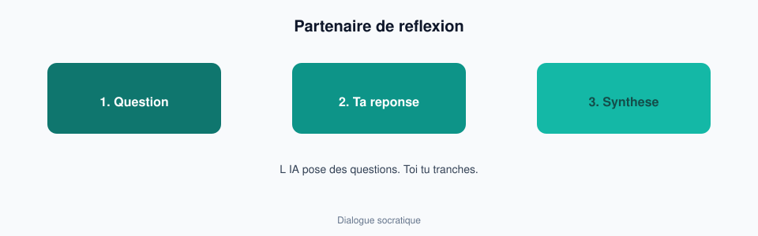

# Module 04 — Partenaire de réflexion

> **Temps estimé** : 45 min | **Prérequis** : Modules 01–03
>
> **Objectif** : Utiliser ChatGPT comme tuteur socratique et challenger d'idées — sans te faire "donner la réponse" et perdre l'apprentissage.

---

> **En une phrase :** L IA pose des questions ; toi tu reponds et tu tranches.

## 1. Scène concrete : le piège du conseil tout cuit

Alex : *« Est-ce que je devrais quitter mon poste pour un pivot entrepreneuriat ? »*

Mauvaise réponse du système (et de beaucoup d'usages) : une liste de 10 raisons + un plan de vie. **Ça soulage 5 minutes et ne clarifie rien.**

Meilleure posture : *« Pose-moi une question à la fois pour clarifier mes contraintes (argent, energie, delai de formation, valeurs). Ne conseille pas avant d'avoir 8 réponses. »*

> **À retenir :** L'IA utile pour réfléchir **pose des questions** et structure *tes* réponses — elle ne décide pas à ta place.

---

## 2. Trois rôles utiles (inspirés Mollick)

Mollick & Mollick (2023) decrivent plusieurs facons d'*assigner* l'IA aux étudiants : tuteur, coach, co-éditeur, etc. — a condition que l'étudiant reste actif. [Mollick, 2023]

| Rôle | Prompt d'entrée | Tu fais quoi |
|------|-----------------|--------------|
| Tuteur socratique | "Ne m'explique pas : questionne-moi" | Reponds d'abord |
| Avocat du diable | "Attaque mon idée en 5 points durs" | Renforces ou abandonnes |
| Structurateur | "Organise mes notes en 3 options + critères" | Tu tranches |

Bloom (1984) montrait l'effet puissant du **tutorat + mastery** : l'IA peut *simuler* un tuteur, mais l'effet disparait si tu restes passif. [Bloom, 1984]

---

## 3. Protocole 15 minutes (carrière / études)

1. **Cadre (2 min)** : ecris 5 lignes de contexte *sans* l'IA.
2. **Session questions (10 min)** : rôle socratique, 1 question à la fois.
3. **Synthese (3 min)** : "Résumé mes réponses en 5 puces. N'ajoute rien."
4. **Vérification** : est-ce que le résumé te ressemble ? Corrige à la main.

Dunlosky et al. (2013) rappellent que se tester et elaborer bat la relecture passive — même logique ici : **produire** tes réponses. [Dunlosky, 2013]

---

## 4. Pièges

- L'IA qui te flatte ("excellent choix !") → demande un ton neutre.
- L'IA qui invente des "stats sur le marche de l'emploi" → checklist J3.
- L'IA qui melange ton contexte et des cliches LinkedIn → "utilise uniquement mon texte".

---

## Spaced repetition

**Q1.** Pourquoi demander des questions plutot qu'un plan tout fait ?
**R1.** Pour forcer ta propre clarté ; le plan tout fait est generique et passif.

**Q2.** Nomme 2 rôles IA utiles pour réfléchir.
**R2.** Tuteur socratique ; avocat du diable (ou structurateur).

**Q3.** Que signifie rester actif avec un tuteur LLM ?
**R3.** Repondre, corriger, trancher — pas seulement lire.

**Q4.** Quelle référence educative justifie le tutorat intense ?
**R4.** Bloom, 2 Sigma Problem (1984). [Bloom, 1984]

**Q5.** Derniere étape du protocole 15 min ?
**R5.** Faire valider/corriger à la main le résumé de *tes* réponses.
