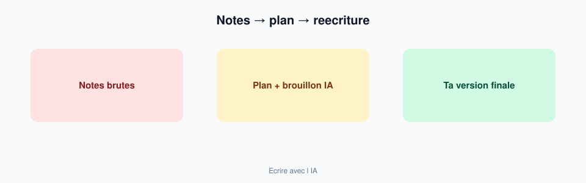

# Module 05 — Écrire avec l'IA (Word / rapports)

> **Temps estimé** : 45 min | **Prérequis** : Modules 02–04
>
> **Objectif** : Produire un brouillon utile (plan + page) pour un rendu type formation, puis le réapproprier à la main.

---



> **En une phrase :** L IA aide au brouillon ; la version finale est la tienne.


## 1. Scène concrete : le rapport de 3 pages pour hier

Tu as des notes de cours eparses et un enonce. ChatGPT peut :

1. transformer tes notes en **plan** ;
2. proposer un **premier jet** section 1 ;
3. te signaler les trous logiques.

Il ne doit **pas** devenir l'auteur cache du devoir entier (éthique + apprentissage + detection).

Mollick (2023) insiste sur des usages ou l'étudiant *assigne un rôle* à l'IA tout en restant responsable du rendu. [Mollick, 2023]

> **À retenir :** Pipeline honnete = **tes idées → structure IA → brouillon IA → réécriture humaine majoritaire**.

---

## 2. Pipeline en 5 étapes

| Étape | Toi | IA |
|-------|-----|----|
| 1. Brutes | Notes, consignes, idées en vrac | — |
| 2. Plan | Valides les titrès | Propose outline |
| 3. Brouillon | Choisis section prioritaire | Genere 300–500 mots |
| 4. Réécriture | Reecris ~30–50 % minimum | — |
| 5. Contrôles | Faits, consignes, ton | "Liste les faiblesses" |

Prompts de format : preciser longueur, public, niveau de langue. [OpenAI Prompting Guide]

---

## 3. Prompt modèle "rapport formation"

```
Role : assistant redaction academique (niveau certificat, pas these).
Contexte : [colle l'enonce + tes 10 puces de notes].
Tache : (1) outline en 5 parties (2) redige UNIQUEMENT la partie 2 (max 400 mots).
Contraintes :
- francais canadien professionnel ;
- aucune source inventee — si besoin de source, ecrire [A_VERIFIER] ;
- ne pas flatter ; signaler les trous dans mon raisonnement en fin de reponse.
```

---

## 4. Signes que tu as trop delegue

- Tu ne peux pas expliquer un paragraphe à voix haute.
- Le vocabulaire n'est pas le tien.
- Des références "ScienceDirect 2019" non vérifiées.
- L'intro pourrait servir a n'importe quel sujet voisin.

**Remede :** fermer le chat, réécrire la section de mémoire, puis rouvrir pour polish seulement.

---

## Spaced repetition

**Q1.** Quelle est l'étape non négociable après un brouillon IA ?
**R1.** Réécriture humaine substantielle + vérification des faits.

**Q2.** Que mettre dans le prompt pour éviter les fausses sources ?
**R2.** Interdiction d'inventer ; marqueur [A_VERIFIER].

**Q3.** Pourquoi générer une seule section d'abord ?
**R3.** Contrôler la qualité et rester proprietaire du fond.

**Q4.** Cite un usage éthique vs non éthique.
**R4.** Éthique : plan + relecture. Non éthique : devoir entier non relu/non compris.

**Q5.** Référence utile sur les rôles IA en éducation ?
**R5.** Mollick & Mollick, Assigning AI (2023). [Mollick, 2023]
