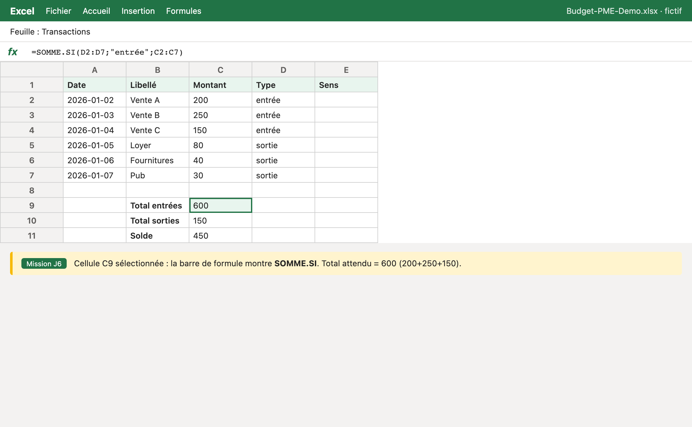
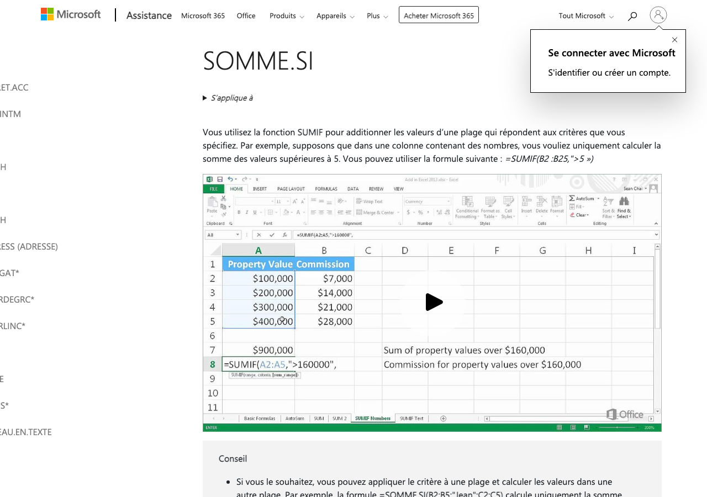

# Module 06 — Excel + IA : les bases

> **Temps estime** : 45 min | **Prerequis** : Modules 02–03
>
> **Objectif** : Obtenir de ChatGPT des formules Excel correctes a partir d'une description en francais, les coller, et comprendre les erreurs courantes.

---


> **En une phrase :** regarde ce schema avant de lire le reste.

### Ecran exemple — mission J6 dans Excel



> Classeur fictif `Budget-PME-Demo` — total entrees **600**. Compare avec ta feuille.



> Capture publique : [Fonction SOMME.SI (Microsoft)](https://support.microsoft.com/fr-fr/office/fonction-somme-si-169b8c99-c05c-4483-a712-1697a653039b).


## 1. Scene concrete : "fais-moi le total"

Sans IA : tu cherches dans Google "somme si excel".
Avec IA : tu **decris ton tableau** et tu demandes la formule **dans ta langue Excel** (FR-CA ou EN selon ta version).

Exemple de description efficace :

```
Mon tableau est en A1:E20.
A = Date, B = Libelle, C = Categorie, D = Montant, E = Type (entree ou sortie).
Ligne 1 = en-tetes.
Donne la formule FR pour totaliser les montants ou Type = "entree".
Explique chaque partie de la formule en 1 phrase.
```

La doc Microsoft rappelle la structure des formules (`=`, operateurs, references). [Microsoft formulas overview]

> **A retenir :** ChatGPT ne "voit" pas ton fichier (sauf si tu utilises une fonction fichiers / Copilot). Il raisonne sur **ta description**. Sois precise.

---

## 2. Protocole Excel+ChatGPT (sans magie)

1. **Nomme les colonnes** et la plage.
2. **Dis la locale** : formules FR (`SOMME`, `SI`) ou EN (`SUM`, `IF`).
3. **Demande un test** : "donne un mini-exemple numerique attendu".
4. **Colle dans Excel** sur une copie du fichier.
5. **Si erreur** (`#NOM?`, `#DIV/0!`, `#REF!`) : copie le message d'erreur dans le chat.

---

## 3. Erreurs classiques (et quoi renvoyer a l'IA)

| Erreur | Cause frequente | Message au chat |
|--------|-----------------|-----------------|
| `#NOM?` | Fonction EN dans Excel FR | "Traduis en formules francaises Excel" |
| `#DIV/0!` | Division par zero | "Ajoute une garde SI" |
| `#REF!` | Colonne supprimee | "Reecris avec colonnes A–E ci-dessus" |
| Resultat faux | Mauvaise plage | "Inclus la ligne 2 a 20 seulement" |

---

## 4. Prompt modele "3 formules"

Utilise la grille RCCFC (J2). [OpenAI Prompting Guide]

```
Role : formateur Excel Microsoft 365, public non-tech.
Contexte : [description colonnes].
Tache : 3 formules — total entrees, total sorties, solde (entrees - sorties).
Format : tableau | Objectif | Formule | Explication | Test manuel |
Contraintes : formules FR ; pas de VBA ; pas de Power Query.
```

---

## 5. Hygiene

- Travaille sur **fichier fictif** ou anonymise.
- Garde une version "avant formules IA".
- Ne demande jamais a l'IA de "deviner" des montants reels manquants : fournis des **exemples inventes**.

---

## Spaced repetition

**Q1.** Pourquoi decrire les colonnes est obligatoire ?
**R1.** Sans schema, le modele invente une structure qui ne matche pas ton fichier.

**Q2.** Que faire face a `#NOM?` apres collage ?
**R2.** Verifier la langue des fonctions (FR vs EN) et redemander une traduction.

**Q3.** ChatGPT voit-il toujours ton classeur ?
**R3.** Non par defaut ; il s'appuie sur ta description (sauf outils/fichiers/Copilot).

**Q4.** Quelle est la 1re etape de securite ?
**R4.** Travailler sur une copie / donnees fictives.

**Q5.** Ou trouver la reference officielle sur les formules Excel ?
**R5.** Documentation Microsoft "Overview of formulas in Excel". [Microsoft formulas overview]
