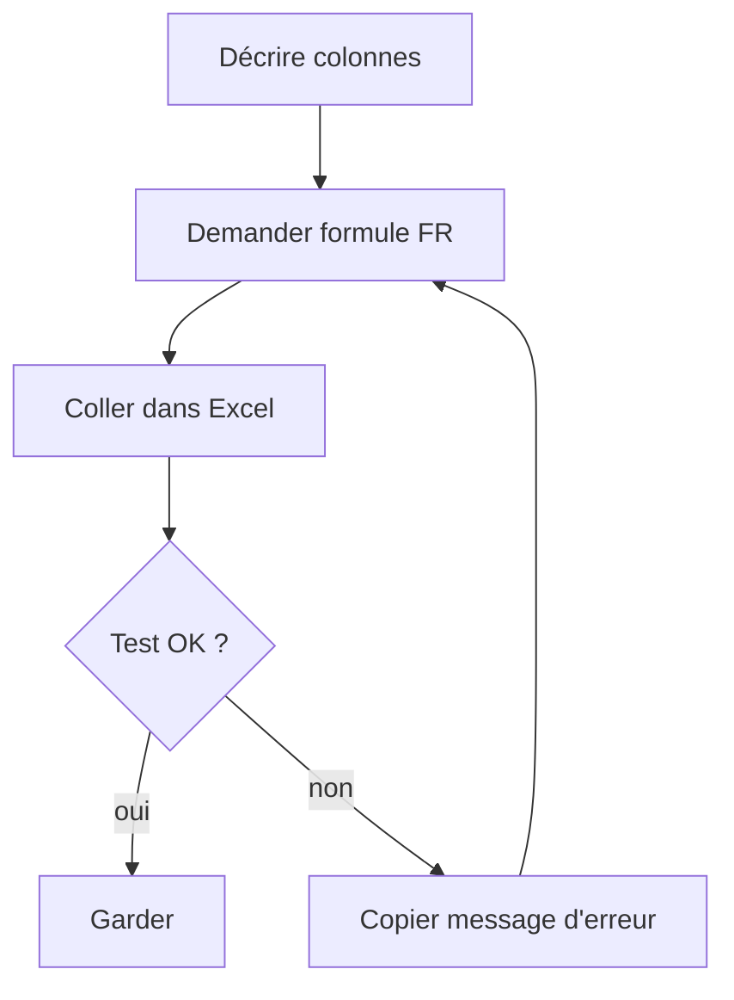

# Module 06 — Excel + IA : les bases

> **Temps estimé** : 45 min | **Prérequis** : Modules 02–03
>
> **Objectif** : Obtenir de ChatGPT des formules Excel correctes à partir d'une description en français, les coller, et comprendre les erreurs courantes.

---


> **En une phrase :** regarde ce schéma avant de lire le reste.

### Écran exemple — mission J6 dans Excel


> Classeur fictif `Budget-PME-Demo` — total entrées **600**. Compare avec ta feuille.


> Capture publique : [Fonction SOMME.SI (Microsoft)](https://support.microsoft.com/fr-fr/office/fonction-somme-si-169b8c99-c05c-4483-a712-1697a653039b).





## 1. Scène concrète : « fais-moi le total »

Sans IA : tu cherches dans Google « somme si excel ».
Avec IA : tu **décris ton tableau** et tu demandes la formule **dans ta langue Excel** (FR-CA ou EN selon ta version).

Exemple de description efficace :

```
Mon tableau est en A1:E20.
A = Date, B = Libellé, C = Catégorie, D = Montant, E = Type (entrée ou sortie).
Ligne 1 = en-têtes.
Donne la formule FR pour totaliser les montants où Type = "entrée".
Explique chaque partie de la formule en 1 phrase.
```

La doc Microsoft rappelle la structure des formules (`=`, opérateurs, références). [Microsoft formulas overview]

> **À retenir :** ChatGPT ne « voit » pas ton fichier (sauf si tu utilises une fonction fichiers / Copilot). Il raisonne sur **ta description**. Sois précise.

---

## 2. Protocole Excel+ChatGPT (sans magie)

1. **Nomme les colonnes** et la plage.
2. **Dis la locale** : formules FR (`SOMME`, `SI`) ou EN (`SUM`, `IF`).
3. **Demande un test** : « donne un mini-exemple numérique attendu ».
4. **Colle dans Excel** sur une copie du fichier.
5. **Si erreur** (`#NOM?`, `#DIV/0!`, `#REF!`) : copie le message d'erreur dans le chat.

---

## 3. Erreurs classiques (et quoi renvoyer à l'IA)

| Erreur | Cause fréquente | Message au chat |
|--------|-----------------|-----------------|
| `#NOM?` | Fonction EN dans Excel FR | « Traduis en formules françaises Excel » |
| `#DIV/0!` | Division par zéro | « Ajoute une garde SI » |
| `#REF!` | Colonne supprimée | « Réécris avec colonnes A–E ci-dessus » |
| Résultat faux | Mauvaise plage | « Inclus la ligne 2 à 20 seulement » |

---

## 4. Prompt modèle « 3 formules »

Utilise la grille RCCFC (J2). [OpenAI Prompting Guide]

```
Rôle : formateur Excel Microsoft 365, public non-tech.
Contexte : [description colonnes].
Tâche : 3 formules — total entrées, total sorties, solde (entrées - sorties).
Format : tableau | Objectif | Formule | Explication | Test manuel |
Contraintes : formules FR ; pas de VBA ; pas de Power Query.
```

---

## 5. Hygiène

- Travaille sur **fichier fictif** ou anonymisé.
- Garde une version « avant formules IA ».
- Ne demande jamais à l'IA de « deviner » des montants réels manquants : fournis des **exemples inventés**.

---

## Spaced repetition

**Q1.** Pourquoi décrire les colonnes est obligatoire ?
**R1.** Sans schéma, le modèle invente une structure qui ne matche pas ton fichier.

**Q2.** Que faire face à `#NOM?` après collage ?
**R2.** Vérifier la langue des fonctions (FR vs EN) et redemander une traduction.

**Q3.** ChatGPT voit-il toujours ton classeur ?
**R3.** Non par défaut ; il s'appuie sur ta description (sauf outils/fichiers/Copilot).

**Q4.** Quelle est la 1re étape de sécurité ?
**R4.** Travailler sur une copie / données fictives.

**Q5.** Où trouver la référence officielle sur les formules Excel ?
**R5.** Documentation Microsoft « Overview of formulas in Excel ». [Microsoft formulas overview]
