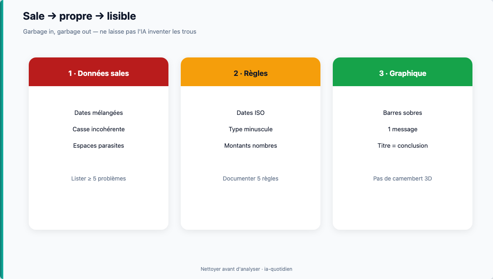

# Module 08 — Nettoyer, analyser, visualiser

> **Temps estimé** : 45 min | **Prérequis** : Modules 06–07
>
> **Objectif** : Passer d'une liste « sale » fictive à un tableau propre + un graphique sobre, avec l'aide de ChatGPT pour la méthode (pas pour inventer des chiffres).

---



> **En une phrase :** On nettoie avant d'analyser et de dessiner.


## 1. Scène concrète : l'export « crade »

Tu reçois (fictif) une liste collée depuis un export bancaire « maison » :

```
12/01/2026; loyer ; 1200 ; sortie
2026-01-15; Cafe equipe; 45,5; Sortie
...
```

Problèmes visibles en dix secondes : dates mélangées, espaces en trop, majuscules au hasard, virgules ou points selon le jour.

**Rôle de l'IA :** te donner une **checklist de nettoyage** et des formules (`SUPPRESPACE`, `MAJUSCULE`, `DATEVALUE` selon ta locale) — pas inventer les lignes manquantes.

> **À retenir :** Garbage in, garbage out. Nettoyer **avant** d'analyser.

---

## 2. Checklist de nettoyage (à coller dans ChatGPT)

```
Voici 15 lignes échantillon (fictives).
1) Liste les problèmes de qualité.
2) Propose un ordre de nettoyage en 6 étapes dans Excel (sans Power Query d'abord).
3) Donne les formules FR utiles pour espaces et casse.
Ne complète pas les montants manquants : signale-les.
```

---

## 3. Analyser sans se noyer

Questions utiles (Few : commencer par la question métier) [Few, 2012] :

1. Combien sort / entre ce mois ?
2. Quelle catégorie domine les sorties ?
3. Y a-t-il des doublons de libellés ?

---

## 4. Visualiser avec sobriété

| À faire | À éviter |
|---------|----------|
| 1 graphique = 1 message | 3D, arcs-en-ciel |
| Barres pour comparer catégories | Camembert à 12 parts |
| Titre qui dit la conclusion | Titre « Graphique 1 » |

Prompt :

```
J'ai catégories en A et totaux en B. Quel type de graphique recommander et pourquoi (max 5 phrases) ? Style sobre type Stephen Few.
```

---

## 5. Livrable du jour

- Tableau propre (fictif)
- 1 graphique
- 3 puces d'insight **écrites par toi** (l'IA peut proposer, tu valides)

---

## Spaced repetition

**Q1.** Pourquoi ne pas laisser l'IA « compléter » les trous de montants ?
**R1.** Risque d'invention ; les trous doivent rester visibles.

**Q2.** Donne 2 symptômes de données sales.
**R2.** Dates multi-formats ; catégories avec casses différentes.

**Q3.** Quel graphique pour comparer 5 catégories de dépenses ?
**R3.** Barres (plutôt qu'un camembert surchargé).

**Q4.** Que doit exprimer le titre du graphique ?
**R4.** Le message / la conclusion, pas un numéro.

**Q5.** Référence design de données citée ?
**R5.** Stephen Few, Show Me the Numbers. [Few, 2012]

<!-- NAV:START -->
---

← [Module 07 — Formules, tableaux croisés & modèles](./07-formules-tableaux.md) · [Index des chapitres](../README.md#index-des-chapitres-cliquable) · [Mission easy](../03-exercises/01-easy/08-nettoyer-analyser.md) · [Progression](../PROGRESS.md) · [Module 09 — Projet secondaire : trésorerie / budget PME (fictif)](./09-projet-tresorerie.md) →

<!-- NAV:END -->
