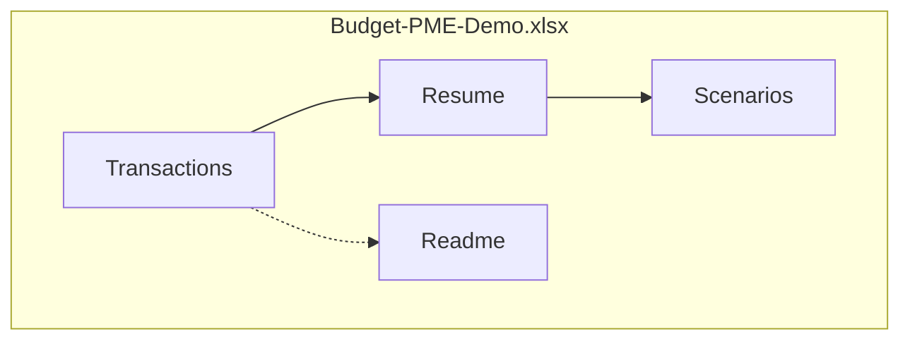

# Module 09 — Projet secondaire : tresorerie / budget PME (fictif)

> **Temps estime** : 60 min | **Prerequis** : Modules 06–08
>
> **Objectif** : Livrer un classeur **Budget PME Demo** reutilisable (transactions, resume, 3 scenarios), 100 % fictif, documente.

---



> **Visuel mental** : 4 onglets, zero donnee reelle d'employeur.


## 1. Scene concrete : le livrable "portfolio Excel"

A la fin de l'heure, tu as un fichier que tu peux montrer (ecole, entretien, ou a toi-meme) :

**`Budget-PME-Demo.xlsx`**

- Onglet `Transactions` (20–40 lignes inventees)
- Onglet `Resume` (totaux, solde, % depenses)
- Onglet `Scenarios` (base / optimiste / pessimiste)
- Onglet `Readme` (5 lignes : hypothese, outils, ce que l'IA a fait, ce que tu as verifie)

Ce n'est **pas** le budget de ton employeur. [CNIL IA] [NIST AI RMF]

> **Key takeaway :** Un projet fictif bien fait enseigne le geste pro **sans** exposer de donnees sensibles.

---

## 2. Cahier des charges (acceptance)

- [ ] Au moins 20 transactions fictives coherentes (dates sur 1–2 mois)
- [ ] Categories claires (loyer, salaires, marketing, fournitures, ventes…)
- [ ] Formules de totaux (pas de totaux tapes a la main)
- [ ] Solde = entrees − sorties
- [ ] 3 scenarios documentes (ex. +10 % ventes / −10 % ventes)
- [ ] Aucune donnee reelle identifiable
- [ ] Notes "genere avec aide ChatGPT" + liste des formules cles

---

## 3. Session guidee avec ChatGPT (45 min)

**Bloc A (10 min)** — Generer le jeu de donnees 
```
Cree un jeu CSV fictif de 25 transactions pour une PME de cafe mobile en ville (janv. 2026).
Colonnes: date, libelle, categorie, montant, type(entree/sortie).
Montants realistes mais inventes. Pas de vrais noms de personnes.
```

**Bloc B (15 min)** — Formules Resume 
(reprendre prompts J6–J7) [Microsoft formulas overview]

**Bloc C (10 min)** — Scenarios 
```
Explique comment modeliser 3 scenarios en gardant les transactions fixes et en appliquant des % sur un onglet Scenarios. Formules FR.
```

**Bloc D (10 min)** — Readme humain 
Tu ecris 5 lignes **sans** IA, puis tu demandes une relecture de clarte seulement.

---

## 4. Pieges

- Scenario "optimiste" avec chiffres magiques non relies aux formules 
- Categories en double (`Marketing` / `marketing`) 
- Coller un vrai extrait bancaire "pour gagner du temps" → **interdit**

---

## Spaced repetition

**Q1.** Pourquoi imposer le fictif ici ?
**R1.** Confidentialite + ethique + apprentissage transferable. [CNIL IA]

**Q2.** Quels onglets minimum dans le livrable ?
**R2.** Transactions, Resume, Scenarios, Readme (ou equivalent).

**Q3.** Que doit etre calcule par formule ?
**R3.** Totaux et solde (pas saisis manuellement).

**Q4.** Que mettre dans le Readme ?
**R4.** Hypotheses, role de l'IA, verifications faites.

**Q5.** Lien avec le capstone PPT ?
**R5.** Les insights du budget peuvent illustrer 1–2 slides du pitch formation (toujours fictif).
