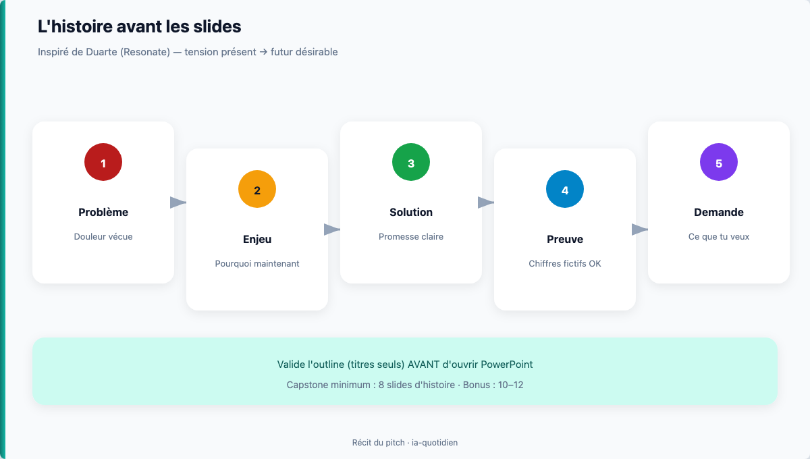

# Module 10 — Structure d'un pitch qui tient

> **Temps estimé** : 45 min | **Prérequis** : Modules 01–09
>
> J9 fournit les chiffres fictifs que tu peux réutiliser dans le pitch.
>
> **Objectif** : Figer l'ossature 8–12 slides du capstone pitch (titres + intention), avant le design.

---



> **En une phrase :** regarde ce schéma avant de lire le reste.


## 1. Scène concrète : 12 slides, zéro histoire

Beaucoup de decks étudiants listent : Idée, Marché, Concurrent, Finances, Merci.
Sans **tension narrative**, l'audience décroche à la slide 3.

Duarte (*Resonate*) propose de penser la présentation comme un mouvement entre **ce qui est** et **ce qui pourrait être**. [Duarte, Resonate]

Heath & Heath (*Made to Stick*) : un message colle s'il est Simple, Unexpected, Concrete, Credible, Emotional, Stories (SUCCESs). [Heath, Made to Stick]

> **À retenir :** D'abord l'**histoire**, ensuite les slides.

---

## 2. Canvas pitch PME / innovation (type formation)

Structure recommandée (adaptable 8–12) :

1. Accroche (problème vécu)
2. Enjeu / pourquoi maintenant
3. Public / client cible
4. Solution en une phrase
5. Comment ça marche (3 étapes max)
6. Preuve ou prototype (même fictif **assumée**)
7. Modèle simple de revenus / impact
8. Chiffres clés (issus de *ton* Excel fictif si utile)
9. Risques & mitigations
10. Demande (ce que tu veux : feedback, partenaires, note)
11. Annexes optionnelles
12. Closing mémorable

---

## 3. Prompt pour générer le plan (*outline*), puis éditer

```
Rôle : coach pitch entrepreneuriat.
Contexte : [3–5 phrases sur mon idée FICTIVE].
Tâche : structure 10 slides. Pour chaque: Titre (max 8 mots) | Intention (1 phrase) | Contenu max 3 bullets.
Contraintes : narrative problème→solution ; pas de jargon vide ; signale les slides faibles.
```

**Règle :** tu réécris les titres pour qu'ils sonnent comme **toi**.

---

## 4. Critère « plan validé »

- [ ] On comprend le problème en 20 secondes
- [ ] La solution tient en une phrase
- [ ] 1 slide chiffres max (clairs)
- [ ] Une demande finale explicite
- [ ] Aucune source inventée présentée comme réelle

---

## Spaced repetition

**Q1.** Que faire avant d'ouvrir PowerPoint ?
**R1.** Valider l'histoire et le plan (titres + intentions).

**Q2.** Idée centrale de Duarte sur le récit ?
**R2.** Alterner / tendre entre présent et futur désirable. [Duarte, Resonate]

**Q3.** Que signifie le « C » de Concrete dans SUCCESs ?
**R3.** Des faits concrets, pas d'abstractions vagues. [Heath, Made to Stick]

**Q4.** Combien de slides vise le capstone ?
**R4.** 8 à 12.

**Q5.** Peut-on utiliser les chiffres du projet Excel ?
**R5.** Oui s'ils sont fictifs et assumés comme démo.

<!-- NAV:START -->
---

← [Module 09 — Projet fil rouge : trésorerie / budget PME (fictif)](./09-projet-tresorerie.md) · [Index des chapitres](../README.md#index-des-chapitres-cliquable) · [Mission easy](../03-exercises/01-easy/10-structure-pitch.md) · [Progression](../PROGRESS.md) · [Module 11 — Slides & design sobre](./11-slides-visuels.md) →

<!-- NAV:END -->
