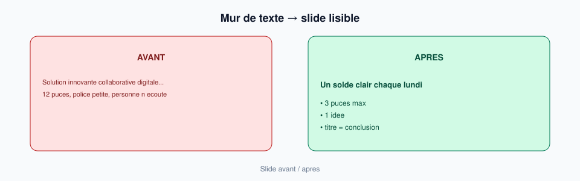

# Module 11 — Slides & design sobre

> **Temps estimé** : 45 min | **Prérequis** : Module 10
>
> **Objectif** : Transformer l'outline en contenu slide-ready (peu de texte, hiérarchie claire) avec l'aide de ChatGPT.

---



> **En une phrase :** Une idée, trois puces, titre = conclusion.

### Écran exemple — slide sobre


> 1 idée, 3 puces, titre = conclusion. Reproduis ce niveau de sobriété sur 4 slides.


## 1. Scène concrète : le mur de texte

Slide typique ratée : 12 puces, police 14, logo en coin, fond chargé.
L'orateur lit. L'audience lit. Personne n'écoute.

Reynolds (*Présentation Zen*) : restraint, simplicité, naturalité — **une idée dominante par slide**. [Reynolds, Présentation Zen]

> **À retenir :** Si tout est important, rien n'est important. Coupe.

---

## 2. Règles opératoires (non négociables du cours)

1. **Max 1 idée** par slide
2. **Max 3 bullets** (7–10 mots chacun) ou 1 phrase forte
3. Titre = conclusion, pas thème vague (« Marché » → « Les cafés de quartier perdent 4 h/semaine en stock »)
4. Visuel simple (icône, schéma 3 blocs) > photo stock gênante
5. Notes orateur = hors slide (J12)

---

## 3. Prompt « slide-ready »

```
Rôle : éditeur Presentation Zen.
Entrée : [ma slide outline + bullets trop longs].
Tâche : réécris titre + max 3 bullets courts. Propose 1 idée de visuel simple (description, pas d'image générée obligatoire).
Contraintes : français clair ; zéro anglicisme inutile ; garde mon sens.
```

Duarte rappelle que le slide soutient le récit, il ne le remplace pas. [Duarte, Resonate]

---

## 4. Atelier du jour

Prends 4 slides de ton outline J10 et produis la version slide-ready. Colle dans PowerPoint. Regarde en mode diaporama : lisibles à 2 mètres ?

---

## Spaced repetition

**Q1.** Combien d'idées max par slide ?
**R1.** Une.

**Q2.** Combien de bullets max recommandés ici ?
**R2.** Trois.

**Q3.** Comment transformer un titre faible « Solution » ?
**R3.** En noncer le bénéfice concret / la promesse.

**Q4.** Où vont les détails d'explication longue ?
**R4.** Notes orateur ou annexe — pas sur le slide.

**Q5.** Référence design de présentation ?
**R5.** Reynolds, Présentation Zen. [Reynolds, Présentation Zen]
