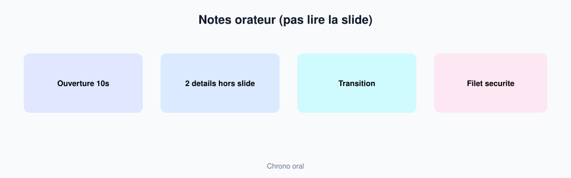

# Module 12 — Notes orateur & répétition

> **Temps estimé** : 45 min | **Prérequis** : Modules 10–11
>
> **Objectif** : Préparer notes orateur + questions pièges pour un oral 5–8 minutes, sans lire les slides.

---



> **En une phrase :** Les notes portent le discours ; la slide ne se lit pas.


## 1. Scène concrete : l'oral qui s'ecroule

Les slides sont propres. L'étudiante lit chaque puce. Chrono depasse. Une question simple ("d'où vient ce chiffre ?") fait paniquer.

Cause : le deck portait **tout** le discours. Or le deck est un **support**. [Reynolds, Présentation Zen]

> **À retenir :** Si tu as besoin de lire le slide, le slide a trop de texte — où tu manques de notes orateur.

---

## 2. Format de note orateur (par slide)

```
Slide N — [Titre]
- Phrase d'ouverture (10 s)
- 2 details a dire qui ne sont PAS sur le slide
- Transition vers slide N+1 (1 phrase)
- Filet de securite si trou de memoire (1 metaphore)
```

---

## 3. Prompt ChatGPT utile

```
Role : coach d'oral.
Contexte : mon deck (titres + bullets) : [coller].
Tache : pour les slides 1, 4, 7, 10 — generee notes orateur au format ci-dessus + 5 questions pieges d'un prof sceptique avec pistes de reponse HONNETES (y compris "je n'ai pas encore mesure X").
Contraintes : ne pas inventer de chiffres absents de mon texte.
```

L'IA comme partenaire de répétition rejoint l'idée de rôles assignes (coach) chez Mollick. [Mollick, 2023]

---

## 4. Protocole répétition 20 min

1. Timer 7 min — present à voix haute 
2. Note les accrocs 
3. Demande à l'IA : "voici mon transcript approximatif : raccourcis" 
4. Rejoue une fois 
5. Reponds a 3 questions pièges à voix haute

---

## Spaced repetition

**Q1.** A quoi servent les notes orateur ?
**R1.** Porter le discours hors du slide ; éviter la lecture.

**Q2.** Que faire si un chiffre est attaque et non source ?
**R2.** Reconnaître la limite ; proposer comment le mesurer — ne pas inventer.

**Q3.** Duree orale cible ici ?
**R3.** Environ 5–8 minutes.

**Q4.** Combien de fois répéter au minimum ?
**R4.** Au moins 2 passages chronomètrès + questions.

**Q5.** Rôle IA le plus utile ce jour ?
**R5.** Coach d'oral / generateur de questions pièges. [Mollick, 2023]
