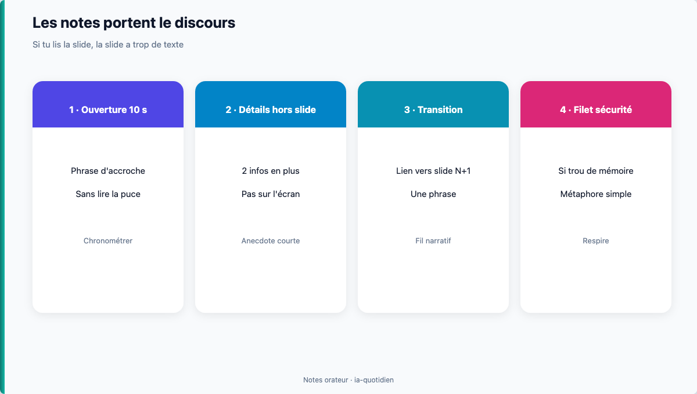

# Module 12 — Notes orateur & répétition

> **Temps estimé** : 45 min | **Prérequis** : Modules 10–11
>
> **Objectif** : Préparer notes orateur + questions difficiles pour un oral (**cible minimale : 6 minutes** ; 6–8 min = bonus), sans lire les slides.

---



> **En une phrase :** Les notes portent le discours ; la slide ne se lit pas.


## 1. Scène concrète : l'oral qui s'écroule

Les slides sont propres. La personne qui présente lit chaque puce. Le chrono dépasse. Une question simple (« d'où vient ce chiffre ? ») fait paniquer.

Cause : le deck portait **tout** le discours. Or le deck est un **support**. [Reynolds, Présentation Zen]

> **À retenir :** Si tu as besoin de lire le slide, le slide a trop de texte — ou tu manques de notes orateur.

---

## 2. Format de note orateur (par slide)

```
Slide N — [Titre]
- Phrase d'ouverture (10 s)
- 2 détails à dire qui ne sont PAS sur le slide
- Transition vers slide N+1 (1 phrase)
- Filet de sécurité si trou de mémoire (1 métaphore)
```

---

## 3. Prompt ChatGPT utile

```
Rôle : coach d'oral.
Contexte : mon deck (titres + bullets) : [coller].
Tâche : pour les slides 1, 4, 7, 10 — génère notes orateur au format ci-dessus + 5 questions difficiles d'un public attentif avec pistes de réponse HONNÊTES (y compris "je n'ai pas encore mesuré X").
Contraintes : ne pas inventer de chiffres absents de mon texte.
```

L'IA comme partenaire de répétition rejoint l'idée de rôles assignés (coach) chez Mollick. [Mollick, 2023]

---

## 4. Protocole répétition 20 min

1. Timer 6–7 min — présente à voix haute
2. Note les accrocs
3. Demande à l'IA : « voici mon transcript approximatif : raccourcis »
4. Rejoue une fois
5. Réponds à 3 questions difficiles à voix haute

---

## Spaced repetition

**Q1.** À quoi servent les notes orateur ?
**R1.** Porter le discours hors du slide ; éviter la lecture.

**Q2.** Que faire si un chiffre est attaqué et non sourcé ?
**R2.** Reconnaître la limite ; proposer comment le mesurer — ne pas inventer.

**Q3.** Durée orale cible ici ?
**R3.** La cible minimale est de 6 minutes ; 6 à 8 minutes est le format bonus.

**Q4.** Combien de fois répéter au minimum ?
**R4.** Au moins 2 passages chronométrés + questions.

**Q5.** Rôle IA le plus utile ce jour ?
**R5.** Coach d'oral / générateur de questions difficiles. [Mollick, 2023]

<!-- NAV:START -->
---

← [Module 11 — Slides & design sobre](./11-slides-visuels.md) · [Index des chapitres](../README.md#index-des-chapitres-cliquable) · [Mission easy](../03-exercises/01-easy/12-notes-orateur.md) · [Progression](../PROGRESS.md) · [Module 13 — Capstone brouillon : deck pitch v1](./13-capstone-brouillon.md) →

<!-- NAV:END -->
