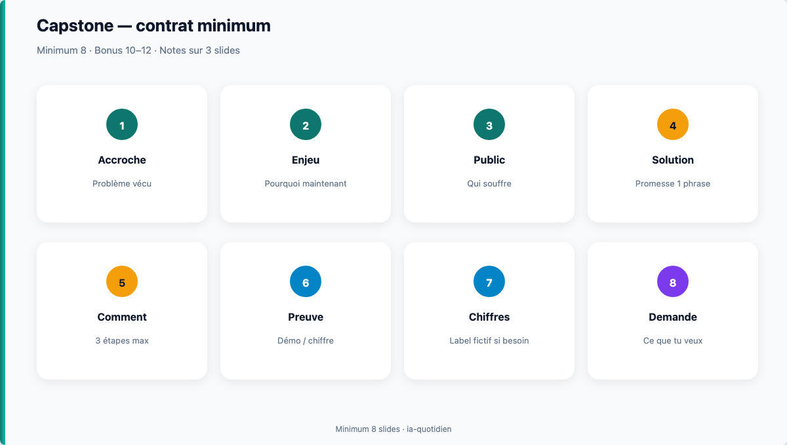

# Module 13 — Capstone brouillon : deck pitch v1

> **Temps estimé** : 45–60 min **ou 2 × 30 min** (multi-soir OK) | **Prérequis** : Modules 09–12
>
> **Objectif** : Assembler un **brouillon complet** 8–12 slides d'un pitch PME/innovation style formation entrepreneuriat, produit principalement avec **ChatGPT**, contenu cohérent de bout en bout.

---



> **En une phrase :** Brouillon complet : minimum 8 slides d'histoire.


## 1. Définition du livrable v1

Tu termines J13 avec un fichier PowerPoint (ou équivalent) qui contient :

- 8 à 12 slides **remplies** (pas seulement des titres)
- une histoire problème → solution lisible
- au plus une slide chiffres (éventuellement tirée du **Budget PME Demo** fictif J9)
- un commentaire en zone notes : « Brouillon v1 — à polir J14 »

Ce n'est pas encore le polish final (J14), mais **plus qu'un outline**.

> **À retenir :** v1 = complet et imparfait. Mieux qu'un plan parfait non assemblé.

---

## 2. Session assemblée (55 min)

| Min | Action |
|-----|--------|
| 0–5 | Choisir l'idée fictive finale (1 phrase) |
| 5–15 | Regénérer outline 10 slides (J10) et figer |
| 15–35 | Pour chaque slide : prompt slide-ready (J11) + collage PPT |
| 35–45 | Insérer 1 slide chiffres depuis Excel fictif si utile |
| 45–55 | Relire en mode diaporama ; noter 5 défauts |

Prompts : toujours RCCFC. [OpenAI Prompting Guide]
Récit : Duarte / Heath. [Duarte, Resonate] [Heath, Made to Stick]

---

## Minimum pour valider J13

- **8 slides remplies** (pas seulement des titres)
- Histoire problème → solution lisible en 60 s
- Commentaire « Brouillon v1 — à polir J14 »
- Aucune étude inventée, aucune donnée employeur réelle

Tout au-delà (12 slides, slide chiffres Excel, polish design) = **bonus** pour J14.

## 3. Checklist anti-catastrophe

- [ ] Aucune « étude 2024 » inventée
- [ ] Aucune donnée employeur réelle
- [ ] Titres = conclusions
- [ ] Tu peux raconter le fil en 60 s sans slides
- [ ] Mentions « exemple fictif » si chiffres démo

---

## 4. Prompt « assemblage critique »

```
Voici mes 10 titres + bullets. Joue l'évaluateur·rice exigeant :
1) note la cohérence narrative /10
2) liste 5 faiblesses actionnables
3) propose une meilleure accroche (3 options)
N'invente pas de nouveaux chiffres.
```

---

## Spaced repetition

**Q1.** Différence J13 vs J14 ?
**R1.** J13 = brouillon complet ; J14 = polish + vérification + oral.

**Q2.** Combien de slides ?
**R2.** 8 à 12.

**Q3.** Outil principal du capstone ?
**R3.** ChatGPT (+ PowerPoint).

**Q4.** Que faire des chiffres Excel ?
**R4.** Les intégrer seulement s'ils servent le récit et restent fictifs/assumés.

**Q5.** Que demander à l'IA en fin de v1 ?
**R5.** Une critique type prof + options d'accroche, sans nouveaux chiffres inventés.

<!-- NAV:START -->
---

← [Module 12 — Notes orateur & répétition](./12-notes-orateur.md) · [Index des chapitres](../README.md#index-des-chapitres-cliquable) · [Mission easy](../03-exercises/01-easy/13-capstone-brouillon.md) · [Progression](../PROGRESS.md) · [Module 14 — Capstone final : deck pitch livrable](./14-capstone-deck-pitch.md) →

<!-- NAV:END -->
