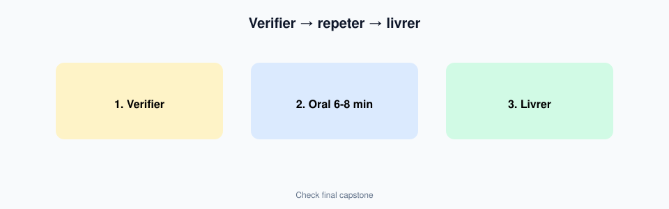
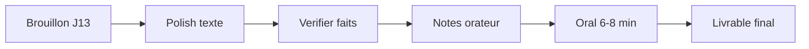

# Module 14 — Capstone final : deck pitch livrable

> **Temps estime** : 60–90 min | **Prerequis** : Module 13
>
> **Objectif** : Livrer le **PowerPoint final 8–12 slides** presentable (style formation entrepreneuriat / pitch PME), plus un journal court d'usage de l'IA. Outil principal : **ChatGPT**.

---

> **En une phrase :** regarde ce schema avant de lire le reste.

## Contrat Minimum / Bonus

| | Minimum (reussi) | Bonus |
|--|------------------|-------|
| Slides | **8** slides d histoire | 10–12 slides |
| Notes orateur | 3 slides cles | 4 slides |
| Journal IA | 5 puces | 1/2–1 page |
| Oral | 6 min chrono | 6–8 min + questions pieges |
| Excel | optionnel | annexe Budget-PME-Demo |

## 1. Definition de "termine"

Ton dossier capstone contient :

1. **`Pitch-PME-Final.pptx`** (8–12 slides) 
2. **Notes orateur** (au moins sur 4 slides cles) 
3. **Journal IA** (1/2–1 page) : ce que ChatGPT a produit, ce que tu as reecrit, ce que tu as refuse, verifications faites 
4. (Optionnel) **`Budget-PME-Demo.xlsx`** en annexe si une slide s'y refere

Critere or : *tu peux presenter en 6–8 minutes sans lire les puces.*

> **A retenir :** Le capstone prouve un **systeme d'usage** (prompts + verification + reappropriation), pas une generation one-shot.

---

## 2. Boucle polish (J14)

| Etape | Action | IA ? |
|-------|--------|------|
| 1 | Couper 20 % du texte restant | Oui (raccourcir) |
| 2 | Uniformiser titres (style) | Oui |
| 3 | Verifier chaque fait/chiffre | Toi + web |
| 4 | Ajouter mentions fictif si besoin | Toi |
| 5 | Oral chronometre | Toi |
| 6 | 5 questions pieges | IA coach puis toi |

Design : restraint Presentation Zen. [Reynolds, Presentation Zen] 
Recit : Resonate. [Duarte, Resonate] 
Prompts : guide OpenAI. [OpenAI Prompting Guide] 
Donnees : jamais de reels sensibles. [CNIL IA]

---

## 3. Rubrique d'auto-evaluation (/20)

| Critere | Points |
|---------|--------|
| Histoire claire probleme→solution | /4 |
| Slides sobres (1 idee, peu de texte) | /4 |
| Ethique & verification (journal IA) | /4 |
| Oral preparable (notes + chrono) | /4 |
| Lien possible Excel fictif / realisme | /2 |
| Proprete fichier (noms, ordre) | /2 |

Vise **≥ 14/20** avant de considerer le parcours reussi.

---

## 4. Apres le cours (maintenance 30 min/semaine)

- 1 usage Excel+IA au travail **sur donnees fictives ou autorisees** 
- 1 session reflexion carriere socratique 
- Mettre a jour 3 prompts modeles dans une note telephone 

Codex / outils dev : uniquement si un jour tu en as besoin — **hors scope de maitrise minimale**.

---

## Spaced repetition

**Q1.** Quels livrables minimum du capstone ?
**R1.** PPTX 8–12 slides + notes cles + journal IA.

**Q2.** Quel outil est primaire ?
**R2.** ChatGPT (avec PowerPoint pour l'assemblage).

**Q3.** Que prouve le journal IA ?
**R3.** Que tu as verifie et reapproprie — pas seulement copie.

**Q4.** Score cible d'auto-eval ?
**R4.** Au moins 14/20 sur la rubrique.

**Q5.** Que faire si une slide cite un chiffre ?
**R5.** Tracer l'origine (Excel fictif / source verifiee) ou retirer.
