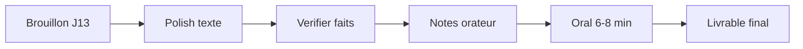

# Module 14 — Capstone final : deck pitch livrable

> **Temps estimé** : **1 à 2 soirs** (pas un rush unique de 90 min) | **Prérequis** : Module 13
>
> **Objectif** : Livrer le **PowerPoint final 8–12 slides** présentable (style formation entrepreneuriat / pitch PME), plus un journal court d'usage de l'IA. Outil principal : **ChatGPT**.

---

> **En une phrase :** regarde ce schéma avant de lire le reste.

### Écran exemple — cible visuelle du deck

> Niveau de clarté vise pour le **minimum 8 slides**.

## Contrat Minimum / Bonus

| | Minimum (réussi) | Bonus |
|--|------------------|-------|
| Slides | **8** slides d histoire | 10–12 slides |
| Notes orateur | 3 slides clés | 4 slides |
| Journal IA | 5 puces | 1/2–1 page |
| Oral | 6 min chrono | 6–8 min + questions pièges |
| Excel | optionnel | annexe Budget-PME-Demo |

## Planning multi-soir (recommandé)

Ne tente pas de tout finir en une seule session de 60–90 min. Découpe :

| Soir | Focus | Minimum |
|------|-------|---------|
| Soir A | Polish texte + couper 20 % | 8 slides lisibles |
| Soir B | Vérifier faits + notes orateur (3 slides) | journal 5 puces |
| Soir C *(bonus)* | Oral chrono + questions pièges + slides 9–12 | présentation fluide |

**Barre de validation du parcours = contrat Minimum uniquement.** Le bonus est pour le portfolio, pas pour « réussir le cours ».

## 1. Définition de "termine"

Ton dossier capstone contient :

1. **`Pitch-PME-Final.pptx`** — **minimum 8 slides** (10–12 = bonus) 
2. **Notes orateur** — **minimum 3 slides clés** (4 = bonus) 
3. **Journal IA** — **minimum 5 puces** (½–1 page = bonus) : ce que ChatGPT a produit, ce que tu as réécrit, ce que tu as refuse, vérifications faites 
4. (Optionnel) **`Budget-PME-Demo.xlsx`** en annexe si une slide s'y réfère

Critère or : *tu peux présenter en 6–8 minutes sans lire les puces.*

> **À retenir :** Le capstone prouve un **système d'usage** (prompts + vérification + réappropriation), pas une génération one-shot.

---

## 2. Bouclé polish (J14)

| Étape | Action | IA ? |
|-------|--------|------|
| 1 | Couper 20 % du texte restant | Oui (raccourcir) |
| 2 | Uniformiser titrès (style) | Oui |
| 3 | Vérifier chaque fait/chiffre | Toi + web |
| 4 | Ajouter mentions fictif si besoin | Toi |
| 5 | Oral chronomètre | Toi |
| 6 | 5 questions pièges | IA coach puis toi |

Design : restraint Présentation Zen. [Reynolds, Présentation Zen] 
Recit : Resonate. [Duarte, Resonate] 
Prompts : guide OpenAI. [OpenAI Prompting Guide] 
Données : jamais de réels sensibles. [CNIL IA]

---

## 3. Rubrique d'auto-évaluation (/20)

| Critère | Points |
|---------|--------|
| Histoire claire problème→solution | /4 |
| Slides sobres (1 idée, peu de texte) | /4 |
| Éthique & vérification (journal IA) | /4 |
| Oral preparable (notes + chrono) | /4 |
| Lien possible Excel fictif / réalisme | /2 |
| Proprête fichier (noms, ordre) | /2 |

Vise **≥ 14/20** avant de considerer le parcours réussi.

---

## 4. Après le cours (maintenance 30 min/semaine)

- 1 usage Excel+IA au travail **sur données fictives ou autorisees** 
- 1 session réflexion carrière socratique 
- Mettre à jour 3 prompts modèles dans une note téléphone 

Codex / outils dev : uniquement si un jour tu en as besoin — **hors scope de maîtrise minimale**.

---

## Spaced répétition

**Q1.** Quels livrables minimum du capstone ?
**R1.** PPTX 8–12 slides + notes clés + journal IA.

**Q2.** Quel outil est primaire ?
**R2.** ChatGPT (avec PowerPoint pour l'assemblage).

**Q3.** Que prouve le journal IA ?
**R3.** Que tu as vérifie et réapproprie — pas seulement copie.

**Q4.** Score cible d'auto-eval ?
**R4.** Au moins 14/20 sur la rubrique.

**Q5.** Que faire si une slide cite un chiffre ?
**R5.** Tracer l'origine (Excel fictif / source vérifiée) ou retirer.
