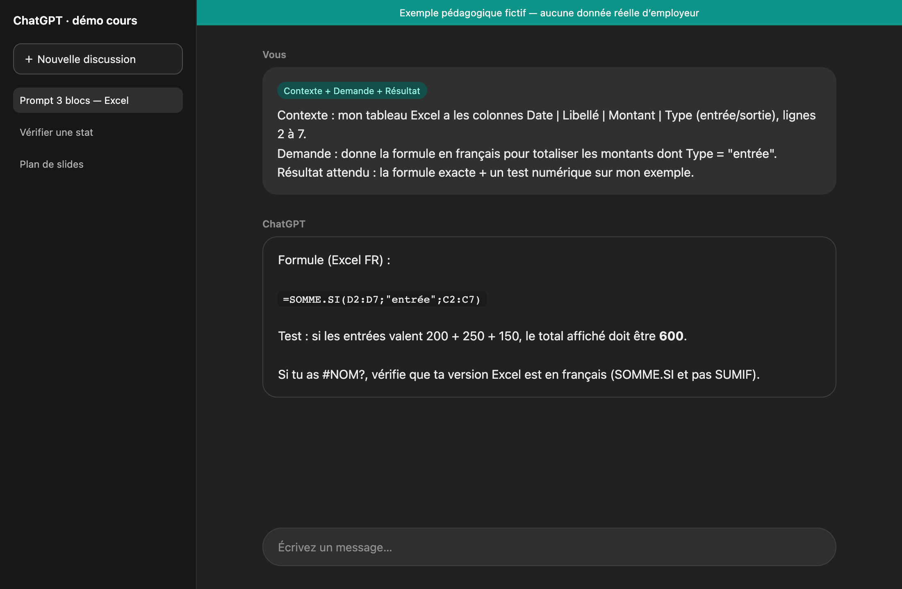

# Mission J2 — Prompt en 3 blocs (easy)

> **Temps :** ~12 min · **Badge :** Prompt clair

## Mission du jour

**But :** transformer un prompt flou en **Contexte + Demande + Résultat attendu** (RCCFC vient plus tard).

### Prompt flou (mauvais)
> « Améliore mon Excel. »

## Écran de référence



## À faire

1. Réécris en 3 blocs :

```
Contexte : ...
Demande : ...
Résultat attendu : ...
```

2. Envoie ta version à ChatGPT.
3. Note en 1 phrase ce qui a changé par rapport au flou.

## Indice
Mentionne des colonnes inventées (Date, Montant, Type), même fictives.

## Réussite
- [ ] 3 blocs visibles
- [ ] Trace d’une réponse IA
- [ ] 1 phrase de comparaison

## Feedback
Si ChatGPT te renvoie une formule ou des étapes concrètes : **badge Prompt clair.**
