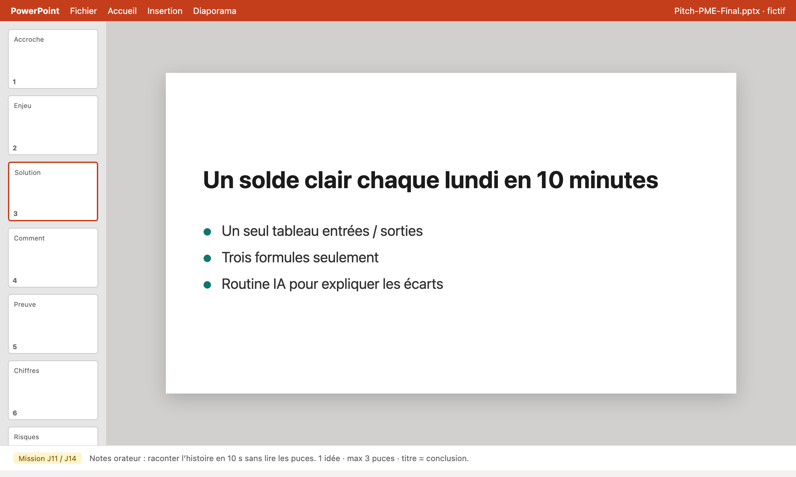

# Mission J14 — Polish minimum (easy)

> **Temps :** ~20 min · **Badge :** Deck presentable

## Mission du jour

**But :** alleger le brouillon pour le **contrat minimum** (8 slides).

## Contrat rappel

| Minimum | Bonus |
|---------|-------|
| 8 slides | 10–12 |
| Notes sur 3 slides | 4 slides |
| Journal 5 puces | page complete |

## Ecran de reference

## A faire

1. Choisis les 5 slides les plus chargees.
2. Avec ChatGPT : « raccourcis a 3 puces max, garde mon sens ».
3. Uniformise les titres (meme style).
4. Avant/apres sur **2** slides (copie texte).

## Indice
Si tout est important, rien n est important : coupe 20 %.

## Reussite
- [ ] 5 slides allegees
- [ ] Avant/apres ×2
- [ ] Au moins 8 slides restantes dans le deck

## Feedback
**Badge Deck presentable** des que le minimum 8 slides se lit en mode diaporama sans mur de texte.
