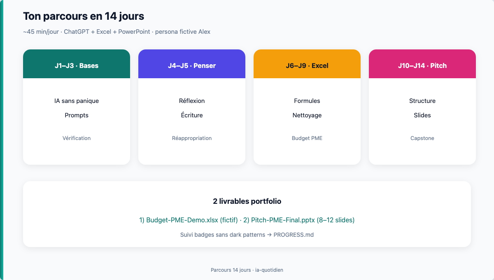

# IA au quotidien (non-tech)




## Ce soir, fais seulement ça

Ne lis pas tout le catalogue. **Ce soir, 3 gestes :**

1. Ouvre [`01-theory/01-ia-sans-panique.md`](./01-theory/01-ia-sans-panique.md) et regarde le schéma en haut (5 min).
2. Fais la **mission easy** : [`03-exercises/01-easy/01-ia-sans-panique.md`](./03-exercises/01-easy/01-ia-sans-panique.md) (~12 min).
3. Coche le badge **Détecteur de confiance** dans [`PROGRESS.md`](./PROGRESS.md).

Les niveaux medium/hard sont **optionnels**. Tu peux avancer à ton rythme : une mission easy bien faite vaut mieux qu'un rush sur trois niveaux.

## Scope

Maîtriser l'**usage pratique de l'IA** (surtout **ChatGPT**) pour :

- réfléchir et clarifier des décisions (carrière, formation) ;
- écrire des brouillons de rapports sans triche passive ;
- **accélérer Excel** (formules, tableaux, budget / trésorerie **fictifs**) ;
- produire un **PowerPoint de type formation entrepreneuriat** (pitch PME / innovation), 8–12 slides.

**Frontières — on exclut :**

- apprendre à coder (Python, ML, fine-tuning) ;
- entraîner un modèle ;
- agents multi-outils / LangGraph ;
- **Codex** comme chemin obligatoire (bonus optionnel pour power-users) ;
- **données réelles** d'un employeur / association, clients, employés ou finances personnelles identifiables.

Public type : débutant·e en IA, profil Office (Excel / PowerPoint), ~45 min/jour.

### Petit glossaire

| Mot | Sens ici |
|-----|----------|
| **Prompt** | Consigne écrite que tu donnes à l'IA |
| **LLM** | Modèle de langage qui produit du texte à partir d'une demande |
| **Plan** (*outline*) | Liste des diapositives et de leur intention |
| **Présentation** (*deck*) | Fichier PowerPoint complet |
| **Mise au propre** (*polish*) | Dernière correction du texte et de la présentation |
| **Projet final** (*capstone*) | Livrable qui clôt le parcours |
| **RCCFC** | Grille de prompt : Rôle, Contexte, Tâche, Format, Contraintes |

## Prérequis

- Savoir ouvrir Excel, PowerPoint, un navigateur.
- Un compte **ChatGPT** (gratuit suffit pour démarrer ; Plus aide pour les fichiers).
- Français lu/écrit confortable.
- Aucun prérequis d'un autre domaine du repo.

## Index des chapitres (cliquable)

Un jour = **1 théorie** + **1 mission easy**. Clique le jour pour ouvrir le cours.

| Jour | Cours (théorie) | Mission easy | Temps |
|------|-----------------|--------------|-------|
| J1 | [IA sans panique](./01-theory/01-ia-sans-panique.md) | [mission](./03-exercises/01-easy/01-ia-sans-panique.md) | 45 min |
| J2 | [Prompts qui marchent](./01-theory/02-prompts-qui-marchent.md) | [mission](./03-exercises/01-easy/02-prompts-qui-marchent.md) | 45 min |
| J3 | [Hallucinations & vérification](./01-theory/03-hallucinations-verification.md) | [mission](./03-exercises/01-easy/03-hallucinations-verification.md) | 45 min |
| J4 | [Partenaire de réflexion](./01-theory/04-partenaire-reflexion.md) | [mission](./03-exercises/01-easy/04-partenaire-reflexion.md) | 45 min |
| J5 | [Écrire avec l'IA](./01-theory/05-ecrire-avec-ia.md) | [mission](./03-exercises/01-easy/05-ecrire-avec-ia.md) | 45 min |
| J6 | [Excel + IA : les bases](./01-theory/06-excel-bases-ia.md) | [mission](./03-exercises/01-easy/06-excel-bases-ia.md) | 45 min |
| J7 | [Formules & tableaux](./01-theory/07-formules-tableaux.md) | [mission](./03-exercises/01-easy/07-formules-tableaux.md) | 45–60 min |
| J8 | [Nettoyer, analyser, visualiser](./01-theory/08-nettoyer-analyser.md) | [mission](./03-exercises/01-easy/08-nettoyer-analyser.md) | 45 min |
| J9 | [**Projet fil rouge** trésorerie PME fictif](./01-theory/09-projet-tresorerie.md) | [mission](./03-exercises/01-easy/09-projet-tresorerie.md) | 60 min |
| J10 | [Structure d'un pitch](./01-theory/10-structure-pitch.md) | [mission](./03-exercises/01-easy/10-structure-pitch.md) | 45 min |
| J11 | [Slides & design sobre](./01-theory/11-slides-visuels.md) | [mission](./03-exercises/01-easy/11-slides-visuels.md) | 45 min |
| J12 | [Notes orateur & répétition](./01-theory/12-notes-orateur.md) | [mission](./03-exercises/01-easy/12-notes-orateur.md) | 45 min |
| J13 | [Capstone brouillon deck pitch](./01-theory/13-capstone-brouillon.md) | [mission](./03-exercises/01-easy/13-capstone-brouillon.md) | 1–2 soirs |
| J14 | [**Capstone final** deck pitch](./01-theory/14-capstone-deck-pitch.md) | [mission](./03-exercises/01-easy/14-capstone-deck-pitch.md) | 1–2 soirs |

Progression badges : [`PROGRESS.md`](./PROGRESS.md) · Contrat détaillé : [`PLAN.md`](./PLAN.md) · Sources : [`REFERENCES.md`](./REFERENCES.md).

**Capstone (J13–J14)** : le **minimum** suffit pour valider le parcours (8 slides + notes sur 3 slides + journal court). Le reste est **bonus**. Prévois **plusieurs soirs** plutôt qu'un rush de 90 min.

### Comment se repérer dans les dossiers

```
ia-quotidien/
├── README.md          ← tu es ici (point d'entrée)
├── PROGRESS.md        ← coches + badges
├── 01-theory/         ← cours du jour (lis ça d'abord)
├── 03-exercises/
│   ├── 01-easy/       ← mission du soir (obligatoire)
│   ├── 02-medium/     ← bonus
│   ├── 03-hard/       ← bonus
│   └── solutions/     ← corrige après avoir essayé
└── assets/            ← schémas + captures d'écran
```

## Critères de réussite

À la fin du parcours, tu peux :

- [ ] Expliquer ce qu'est un LLM et **pourquoi il peut inventer** des faits convaincants
- [ ] Écrire un prompt structuré (rôle, contexte, tâche, format, contraintes) pour 3 usages différents
- [ ] Appliquer une **checklist de vérification** avant d'utiliser une réponse pour l'école ou le travail
- [ ] Produire un **classeur Excel fictif** « Budget / trésorerie PME » avec formules et résumé
- [ ] Livrer un **PowerPoint 8–12 slides** (pitch PME / innovation, style formation entrepreneuriat) réalisé principalement avec ChatGPT
- [ ] Rédiger un court « journal d'usage IA » (ce qui a aidé, ce que tu as réécrit à la main, ce que tu as refusé de coller)

## Garde-fous (non négociables)

1. **Dans ce parcours, données fictives uniquement.** N'envoie jamais de fichier réel (employeur, association, clients, finances personnelles), même pour gagner du temps.
2. **Vérifier** chiffres, citations et lois avant remise scolaire / pro. Un exercice d'entraînement peut te faire vérifier un seul point critique ; un livrable réel demande de vérifier **tous** les faits conservés.
3. L'IA **propose** ; **toi** tu assumes le livrable (éthique scolaire + professionnelle).
4. Outils développeur (ex. Codex) : hors chemin critique de ce cours.

Dans un autre contexte pro, suis d'abord la politique de ton organisation, anonymise, et vérifie que l'outil est autorisé.

## Ressources externes

1. [OpenAI — Prompt engineering](https://platform.openai.com/docs/guides/prompt-engineering)
2. [CNIL — IA](https://www.cnil.fr/)
3. [NIST AI RMF](https://www.nist.gov/itl/ai-risk-management-framework)
4. Duarte, *Resonate* ; Reynolds, *Presentation Zen* (slides)
5. Liste complète : **`REFERENCES.md`**

## Progression ludique

Suivi badges (sans classement) : [`PROGRESS.md`](./PROGRESS.md).

## Écrans d'exemple (parcours pédagogiques)

| Écran | Fichier |
|-------|---------|
| ChatGPT prompt 3 blocs | [`assets/screens/screen-chatgpt-prompt-3-blocs.png`](./assets/screens/screen-chatgpt-prompt-3-blocs.png) |
| Excel SOMME.SI (600) | [`assets/screens/screen-excel-somme-si.png`](./assets/screens/screen-excel-somme-si.png) |
| PowerPoint slide sobre | [`assets/screens/screen-powerpoint-slide-sobre.png`](./assets/screens/screen-powerpoint-slide-sobre.png) |
| Doc Microsoft SOMME.SI | [`assets/screens/screen-docs-excel-somme-si.png`](./assets/screens/screen-docs-excel-somme-si.png) |
| Doc OpenAI prompting | [`assets/screens/screen-docs-openai-prompting.png`](./assets/screens/screen-docs-openai-prompting.png) |

Détail : [`assets/screens/README.md`](./assets/screens/README.md).

## Visuels

Ce domaine est **pensé pour un apprentissage visuel** (chaque module de théorie ouvre sur un schéma) :

| Type | Où | Rôle |
|------|-----|------|
| Illustrations (PNG d'affichage + SVG source) | [`assets/`](./assets/) | Cartes mentales, grilles, parcours |
| Diagrammes Mermaid | dans certains modules `01-theory/` | Flux (prompts, Excel, capstone) |
| Tes propres captures | `03-exercises/workspace/` | Excel, PowerPoint, écrans ChatGPT |

Guide détaillé : [`assets/README.md`](./assets/README.md).

**Persona du cours** : **Alex** — personnage **fictif** utilisé dans les scènes. Ce n'est personne de réel ; adapte les exemples à ta vie (sans coller de données sensibles).

## Solutions (sans code)

Pour chaque jour : une solution **Markdown** lisible dans [`03-exercises/solutions/`](./03-exercises/solutions/) (`NN-….md`). Les fichiers `.py` sont des clés techniques optionnelles (smoke tests), pas le chemin principal.
