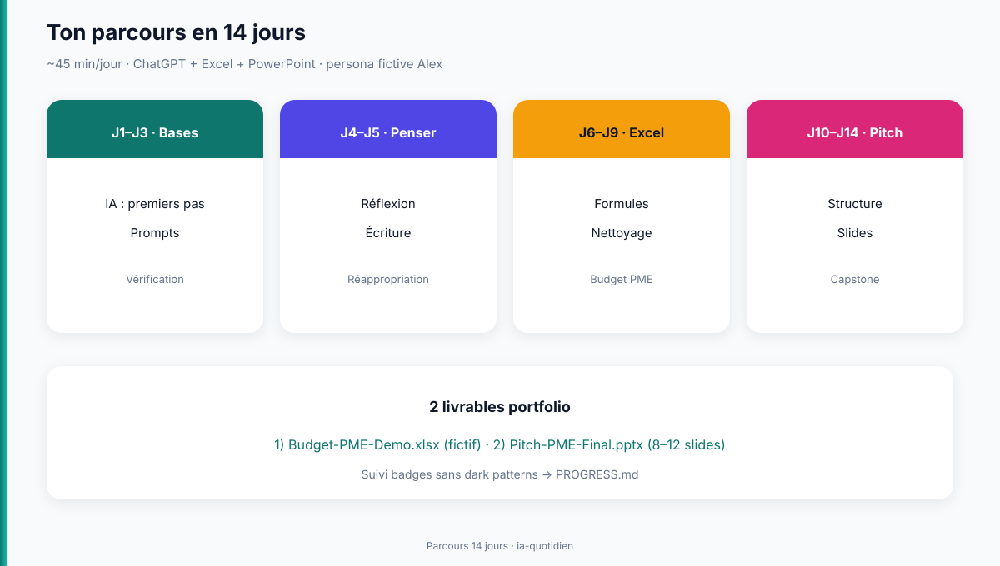

# IA au quotidien (non-tech)

## Ce soir, fais seulement ça

Ne lis pas tout le catalogue. **Ce soir, 3 gestes :**

1. Ouvre [`01-theory/01-ia-sans-panique.md`](./01-theory/01-ia-sans-panique.md) et regarde le schéma en haut (5 min).
2. Fais la **mission easy** : [`03-exercises/01-easy/01-ia-sans-panique.md`](./03-exercises/01-easy/01-ia-sans-panique.md) (~12 min).
3. Coche le badge **Détecteur de confiance** dans [`PROGRESS.md`](./PROGRESS.md).

Les niveaux medium/hard sont **bonus** tant que l'easy n'est pas fait.

## Scope

Maîtriser l'**usage pratique de l'IA** (surtout **ChatGPT**) pour :

- réfléchir et clarifier des décisions (carrière, formation) ;
- écrire des brouillons de rapports sans triche passive ;
- **accélérer Excel** (formules, tableaux, budget / trésorerie **fictifs**) ;
- produire un **PowerPoint de type formation entrepreneuriat** (pitch PME / innovation), 8–12 slides.

**Frontières — on exclut :**

- apprendre à coder (Python, ML, fine-tuning) ;
- entraîner un modèle ;
- agents multi-outils / LangGraph ;
- **Codex** comme chemin obligatoire (bonus optionnel pour power-users) ;
- **données réelles** d'un employeur / association, clients, employés ou finances personnelles identifiables.

Public type : débutant·e en IA, profil Office (Excel / PowerPoint), ~45 min/jour.

## Prérequis

- Savoir ouvrir Excel, PowerPoint, un navigateur.
- Un compte **ChatGPT** (gratuit suffit pour démarrer ; Plus aide pour les fichiers).
- Français lu/écrit confortable.
- Aucun pré-requis d'un autre domaine du repo.

## Planning (2 semaines)

| Jour | Module | Temps estimé |
|------|--------|-------------|
| J1 | IA sans panique | 45 min |
| J2 | Prompts qui marchent | 45 min |
| J3 | Hallucinations & vérification | 45 min |
| J4 | Partenaire de réflexion | 45 min |
| J5 | Écrire avec l'IA | 45 min |
| J6 | Excel + IA : les bases | 45 min |
| J7 | Formules & tableaux | 45–60 min |
| J8 | Nettoyer, analyser, visualiser | 45 min |
| J9 | **Projet Excel** : trésorerie / budget PME fictif | 60 min |
| J10 | Structure d'un pitch | 45 min |
| J11 | Slides & design sobre | 45 min |
| J12 | Notes orateur & répétition | 45 min |
| J13 | Capstone brouillon deck pitch | 1–2 soirs |
| J14 | **Capstone final** deck pitch (minimum 8 slides) | 1–2 soirs |

Voir `PLAN.md` pour le contrat détaillé par jour et `REFERENCES.md` pour les sources.

**Capstone (J13–J14)** : le **minimum** suffit pour valider le parcours (8 slides + notes sur 3 slides + journal court). Le reste est **bonus**. Prévois **plusieurs soirs** plutôt qu'un rush de 90 min.

## Critères de réussite

À la fin du parcours, tu peux :

- [ ] Expliquer ce qu'est un LLM et **pourquoi il peut inventer** des faits convaincants
- [ ] Écrire un prompt structuré (rôle, contexte, tâche, format, contraintes) pour 3 usages différents
- [ ] Appliquer une **checklist de vérification** avant d'utiliser une réponse pour l'école ou le travail
- [ ] Produire un **classeur Excel fictif** « Budget / trésorerie PME » avec formules et résumé
- [ ] Livrer un **PowerPoint 8–12 slides** (pitch PME / innovation, style formation entrepreneuriat) réalisé principalement avec ChatGPT
- [ ] Rédiger un court « journal d'usage IA » (ce qui a aidé, ce que tu as réécrit à la main, ce que tu as refusé de coller)

## Garde-fous (non négociables)

1. **Pas de données réelles** (ONG, clients, salaires, données de santé) dans ChatGPT.
2. **Vérifier** chiffres, citations et lois avant remise scolaire / pro ou usage pro.
3. L'IA **propose** ; **toi** tu assumes le livrable (éthique scolaire + professionnelle).
4. Codex / outils développeur : hors chemin critique de ce cours.

## Ressources externes

1. [OpenAI — Prompt engineering](https://platform.openai.com/docs/guides/prompt-engineering)
2. [CNIL — IA](https://www.cnil.fr/)
3. [NIST AI RMF](https://www.nist.gov/itl/ai-risk-management-framework)
4. Duarte, *Resonate* ; Reynolds, *Presentation Zen* (slides)
5. Liste complète : **`REFERENCES.md`**

## Progression ludique

Suivi badges (sans classement) : [`PROGRESS.md`](./PROGRESS.md).

## Écrans d'exemple (parcours pédagogiques)

| Écran | Fichier |
|-------|---------|
| ChatGPT prompt 3 blocs | [`assets/screens/screen-chatgpt-prompt-3-blocs.png`](./assets/screens/screen-chatgpt-prompt-3-blocs.png) |
| Excel SOMME.SI (600) | [`assets/screens/screen-excel-somme-si.png`](./assets/screens/screen-excel-somme-si.png) |
| PowerPoint slide sobre | [`assets/screens/screen-powerpoint-slide-sobre.png`](./assets/screens/screen-powerpoint-slide-sobre.png) |
| Doc Microsoft SOMME.SI | [`assets/screens/screen-docs-excel-somme-si.png`](./assets/screens/screen-docs-excel-somme-si.png) |
| Doc OpenAI prompting | [`assets/screens/screen-docs-openai-prompting.png`](./assets/screens/screen-docs-openai-prompting.png) |

Détail : [`assets/screens/README.md`](./assets/screens/README.md).

## Visuels

Ce domaine est **pensé pour un apprentissage visuel** (chaque module de théorie ouvre sur un schéma) :

| Type | Où | Rôle |
|------|-----|------|
| Illustrations / SVG | [`assets/`](./assets/) | Cartes mentales, grilles, parcours |
| Diagrammes Mermaid | dans certains modules `01-theory/` | Flux (prompts, Excel, capstone) |
| Tes propres captures | `03-exercises/workspace/` | Excel, PowerPoint, écrans ChatGPT |

Guide détaillé : [`assets/README.md`](./assets/README.md).

**Persona du cours** : **Alex** — personnage **fictif** utilisé dans les scènes. Ce n'est personne de réel ; adapte les exemples à ta vie (sans coller de données sensibles).

## Solutions (sans code)

Pour chaque jour : une solution **Markdown** lisible dans [`03-exercises/solutions/`](./03-exercises/solutions/) (`NN-….md`). Les fichiers `.py` sont des clés techniques optionnelles (smoke tests), pas le chemin principal.
